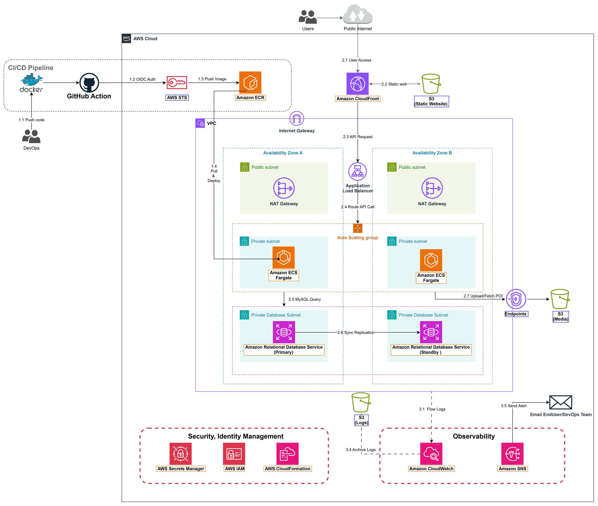

## 1. Giới thiệu dự án

**NeonFoodMap** là nền tảng du lịch số tự động cho **Phố ẩm thực Vĩnh Khánh, Quận 4, TP.HCM**. Ứng dụng giúp du khách khám phá điểm ẩm thực và văn hóa qua bản đồ tương tác, thông tin POI, nội dung đa phương tiện và hướng dẫn âm thanh, truy cập qua vị trí hoặc mã QR.

**Repository:** [github.com/HaoWasabi/NeonFoodmap](https://github.com/HaoWasabi/NeonFoodmap)

**Người dùng:**
- **Du khách**: Tìm kiếm điểm đến và nghe hướng dẫn âm thanh
- **Đối tác kinh doanh**: Cập nhật thực đơn và khuyến mãi
- **Quản trị viên**: Quản lý nội dung, người dùng và vận hành

**Công nghệ:**
- Frontend: React SPA
- Backend: Django REST API
- Database: MySQL

## 2. Vấn đề & Giải pháp

### Thách thức hiện tại

**Vận hành kinh doanh:**
- **Thông tin phân tán**: Dữ liệu vị trí, thực đơn, hình ảnh và nội dung audio bị rải rác trên nhiều nền tảng và hệ thống, khó duy trì tính nhất quán và cung cấp trải nghiệm thống nhất
- **Chi phí vận hành cao**: Quản lý và cập nhật nội dung thủ công đòi hỏi nhiều thời gian và nguồn nhân lực
- **Khó mở rộng quy mô**: Hệ thống hiện tại khó xử lý lượng lớn du khách hiệu quả, đặc biệt trong mùa du lịch cao điểm
- **Trải nghiệm không đồng nhất**: Du khách nhận được chất lượng thông tin khác nhau tùy thuộc vào kênh truy cập

**Hạ tầng kỹ thuật:**
- **Lỗ hổng bảo mật**: Database bị lộ, credentials được hardcode và thiếu kiểm soát truy cập đúng cách tạo ra rủi ro bảo mật nghiêm trọng
- **Triển khai thủ công**: Quy trình triển khai thủ công tốn thời gian dẫn đến chu kỳ phát hành chậm và nguy cơ lỗi do con người cao hơn
- **Không có giám sát**: Thiếu logging, metrics và alerting phù hợp khiến việc phát hiện và giải quyết vấn đề trở nên khó khăn
- **Không rõ chi phí**: Không có cơ chế theo dõi chi phí hạ tầng rõ ràng hoặc ngăn ngừa vượt ngân sách

### Giải pháp triển khai

NeonFoodMap giải quyết các thách thức này thông qua kiến trúc cloud-native hiện đại:

**Nền tảng tập trung:**
- Nền tảng thống nhất duy nhất cho tất cả nội dung POI, media và hướng dẫn audio
- API và data model nhất quán cho mọi giao diện người dùng
- Quản lý nội dung được đơn giản hóa cho đối tác kinh doanh

**Hạ tầng AWS bảo mật:**
- Triển khai VPC Multi-AZ cho tính sẵn sàng cao và khả năng chịu lỗi
- Private subnet cho database và backend service
- IAM role và security group tuân thủ nguyên tắc least-privilege
- Mã hóa dữ liệu khi lưu trữ và truyền tải

**CI/CD tự động:**
- GitHub Actions workflow cho testing và deployment tự động
- Xác thực OIDC loại bỏ AWS credentials lâu dài
- Rolling update zero-downtime cho backend service
- Tự động invalidate CloudFront cache cho frontend update

**Giám sát toàn diện:**
- CloudWatch log và metrics cho tất cả component
- SNS email alert cho vấn đề nghiêm trọng và bất thường
- AWS Budgets và Cost Anomaly Detection cho quản trị tài chính
- Dashboard cho khả năng quan sát sức khỏe hệ thống realtime

## 3. Tổng quan kiến trúc

Hệ thống dùng **kiến trúc đa tầng** trong Amazon VPC trải trên hai Availability Zone tại `ap-southeast-1`:

**Các tầng kiến trúc:**

| Tầng | Thành phần | Mục đích |
|------|-----------|----------|
| **Presentation** | CloudFront, S3 | Phân phối React SPA toàn cầu độ trễ thấp |
| **Application** | ALB, ECS Fargate | Chạy Django API container với auto-scaling |
| **Data** | RDS MySQL, S3 | Lưu dữ liệu nghiệp vụ và media an toàn |
| **Network** | VPC, Subnet, Gateway | Cách ly và định tuyến traffic an toàn |
| **CI/CD** | GitHub Actions, OIDC, ECR | Tự động build và deployment |
| **Monitoring** | CloudWatch, SNS | Theo dõi metrics, log và gửi cảnh báo |

## 4. Công nghệ sử dụng

| Phân loại | Công nghệ |
|-----------|-----------|
| Frontend | React, Vite |
| Backend | Django, Gunicorn, Python, Docker |
| Hạ tầng | AWS VPC, ECS Fargate, RDS MySQL, S3, CloudFront, ALB |
| CI/CD | GitHub Actions, GitHub OIDC, AWS STS, ECR |
| Giám sát | CloudWatch, SNS, AWS Budgets, Cost Anomaly Detection |
| Bảo mật | IAM, Security Groups, Origin Access Control |
