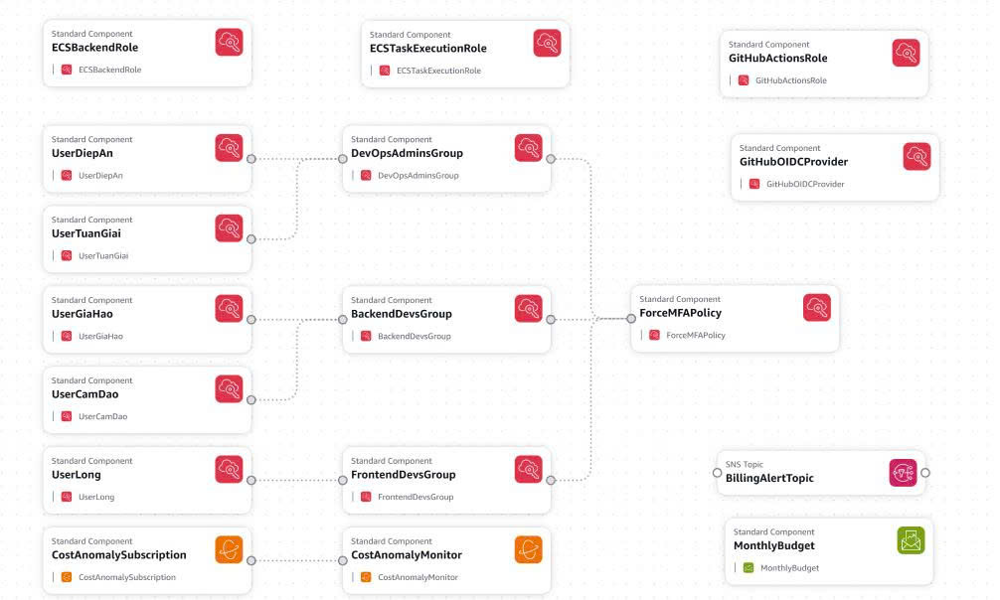
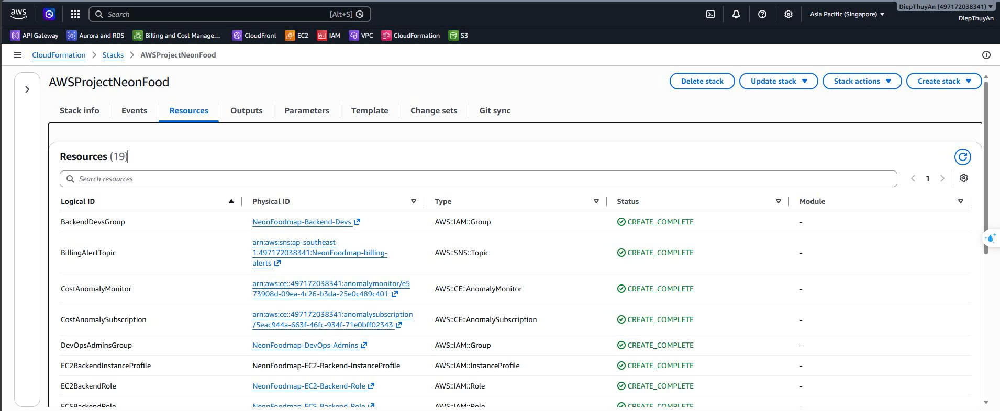

## Tổng quan

Phần này hướng dẫn thiết lập IAM cho dự án NeonFoodmap, bao gồm:
- **IAM Users & Groups**: Quản lý quyền truy cập cho team members
- **IAM Roles cho Services**: Cấp quyền cho ECS tasks và GitHub Actions CI/CD

## Bước 1: Cấp quyền cho Admin User

Trước khi tạo IAM resources khác, admin user cần có đủ quyền. Gắn IAM permission policy sau vào tài khoản AWS user của bạn:



```json
{
  "Version": "2012-10-17",
  "Statement": [
    {
      "Sid": "CloudFormationStackManagement",
      "Effect": "Allow",
      "Action": [
        "cloudformation:CreateStack",
        "cloudformation:CreateChangeSet",
        "cloudformation:UpdateStack",
        "cloudformation:DeleteStack",
        "cloudformation:DeleteChangeSet",
        "cloudformation:DescribeChangeSet",
        "cloudformation:DescribeStacks",
        "cloudformation:DescribeStackEvents",
        "cloudformation:DescribeStackResources",
        "cloudformation:DescribeStackResource",
        "cloudformation:ExecuteChangeSet",
        "cloudformation:GetTemplate",
        "cloudformation:ListStacks",
        "cloudformation:ListStackResources",
        "cloudformation:ValidateTemplate"
      ],
      "Resource": "*"
    },
    {
      "Sid": "IAMResourcesForNeonFoodmap",
      "Effect": "Allow",
      "Action": [
        "iam:AddUserToGroup",
        "iam:AttachGroupPolicy",
        "iam:AttachRolePolicy",
        "iam:CreateGroup",
        "iam:CreateInstanceProfile",
        "iam:CreateLoginProfile",
        "iam:CreateOpenIDConnectProvider",
        "iam:CreatePolicy",
        "iam:CreatePolicyVersion",
        "iam:CreateRole",
        "iam:CreateUser",
        "iam:DeleteGroup",
        "iam:DeleteInstanceProfile",
        "iam:DeleteLoginProfile",
        "iam:DeleteOpenIDConnectProvider",
        "iam:DeletePolicy",
        "iam:DeletePolicyVersion",
        "iam:DeleteRole",
        "iam:DeleteUser",
        "iam:DetachGroupPolicy",
        "iam:DetachRolePolicy",
        "iam:GetGroup",
        "iam:GetInstanceProfile",
        "iam:GetOpenIDConnectProvider",
        "iam:GetPolicy",
        "iam:GetPolicyVersion",
        "iam:GetRole",
        "iam:GetUser",
        "iam:ListAttachedGroupPolicies",
        "iam:ListAttachedRolePolicies",
        "iam:ListGroups",
        "iam:ListGroupsForUser",
        "iam:ListInstanceProfilesForRole",
        "iam:ListOpenIDConnectProviders",
        "iam:ListPolicies",
        "iam:ListPolicyTags",
        "iam:ListPolicyVersions",
        "iam:ListRoleTags",
        "iam:ListRoles",
        "iam:ListUserTags",
        "iam:ListUsers",
        "iam:PassRole",
        "iam:PutGroupPolicy",
        "iam:PutRolePolicy",
        "iam:RemoveRoleFromInstanceProfile",
        "iam:RemoveUserFromGroup",
        "iam:SetDefaultPolicyVersion",
        "iam:TagGroup",
        "iam:TagOpenIDConnectProvider",
        "iam:TagPolicy",
        "iam:TagRole",
        "iam:TagUser",
        "iam:UntagGroup",
        "iam:UntagOpenIDConnectProvider",
        "iam:UntagPolicy",
        "iam:UntagRole",
        "iam:UntagUser",
        "iam:UpdateAssumeRolePolicy",
        "iam:UpdateLoginProfile",
        "iam:UpdateOpenIDConnectProviderThumbprint",
        "iam:UpdateRole",
        "iam:UpdateUser"
      ],
      "Resource": "*"
    },
    {
      "Sid": "SNSBudgetAndCostAnomalyResources",
      "Effect": "Allow",
      "Action": [
        "sns:CreateTopic",
        "sns:DeleteTopic",
        "sns:GetTopicAttributes",
        "sns:ListSubscriptionsByTopic",
        "sns:ListTagsForResource",
        "sns:ListTopics",
        "sns:SetTopicAttributes",
        "sns:Subscribe",
        "sns:TagResource",
        "sns:Unsubscribe",
        "sns:UntagResource",
        "budgets:CreateBudget",
        "budgets:ModifyBudget",
        "budgets:DeleteBudget",
        "budgets:DescribeBudget",
        "budgets:DescribeBudgets",
        "budgets:CreateNotification",
        "budgets:DeleteNotification",
        "budgets:DescribeNotificationsForBudget",
        "budgets:CreateSubscriber",
        "budgets:DeleteSubscriber",
        "budgets:DescribeSubscribersForNotification",
        "ce:CreateAnomalyMonitor",
        "ce:CreateAnomalySubscription",
        "ce:DeleteAnomalyMonitor",
        "ce:DeleteAnomalySubscription",
        "ce:GetAnomalyMonitors",
        "ce:GetAnomalySubscriptions",
        "ce:UpdateAnomalyMonitor",
        "ce:UpdateAnomalySubscription"
      ],
      "Resource": "*"
    }
  ]
}
```



## Bước 2: Tạo IAM Users & Groups bằng CloudFormation

### 2.1. Tạo CloudFormation Stack

Từ CloudFormation Console:
1. Chọn **Create stack** → **Upload a template file**
2. Tải file `neonfoodmap-iam-setup.yaml`
3. Nhập parameters:
   - Tên dự án
   - Mật khẩu cho các thành viên
   - Ngân sách tháng
   - Email nhận cảnh báo
4. Xác nhận quyền tạo IAM resources
5. Tạo stack





### 2.2. IAM Groups được tạo

Template CloudFormation tạo ba nhóm với quyền hạn khác nhau:

| **Group** | **Vai trò** | **Quyền chính** |
|-----------|-------------|-----------------|
| `NeonFoodmap-DevOps-Admins` | Quản lý infrastructure | ECS, RDS, VPC, Networking, CloudFormation |
| `NeonFoodmap-Backend-Devs` | Phát triển backend | ECS, ECR, RDS read-only, CloudWatch logs |
| `NeonFoodmap-Frontend-Devs` | Phát triển frontend | S3, CloudFront invalidation |

**Lưu ý quan trọng:**
- Mọi thành viên **phải bật MFA** để sử dụng các dịch vụ được cấp quyền
- Policy **Force MFA** được áp dụng tự động
- Frontend developers không cần quyền ECS/ECR vì frontend là static assets deploy lên S3

## Bước 3: Tạo IAM Roles cho Services

### 3.1. IAM Role cho ECS Task Execution

Role này cho phép ECS pull Docker images từ ECR và ghi logs vào CloudWatch.

**Các bước thực hiện:**

1. Mở **IAM Console** → **Roles** → **Create role**
2. Chọn trusted entity: **AWS service** → **Elastic Container Service** → **ECS Task**
3. Gắn managed policy: `AmazonECSTaskExecutionRolePolicy`
4. Đặt tên role: `NeonFoodmap-TaskExecution-Role`
5. Tạo role


### 3.2. IAM Role cho ECS Task (Backend Application)

Role này cho phép Django backend truy cập S3 để lưu/đọc media files.

**Các bước thực hiện:**

1. Mở **IAM Console** → **Roles** → **Create role**
2. Chọn trusted entity: **AWS service** → **Elastic Container Service** → **ECS Task**
3. **Không** gắn managed policy (sẽ tạo inline policy)
4. Đặt tên role: `NeonFoodmap-ECS-Backend-Role`
5. Sau khi tạo role, vào role và tạo **inline policy** với nội dung:

```json
{
  "Version": "2012-10-17",
  "Statement": [
    {
      "Effect": "Allow",
      "Action": [
        "s3:ListBucket"
      ],
      "Resource": "arn:aws:s3:::neonfoodmap-media-*"
    },
    {
      "Effect": "Allow",
      "Action": [
        "s3:GetObject",
        "s3:PutObject",
        "s3:DeleteObject"
      ],
      "Resource": "arn:aws:s3:::neonfoodmap-media-*/*"
    }
  ]
}
```


### 3.3. GitHub OIDC Provider và IAM Role cho CI/CD

Thiết lập này cho phép GitHub Actions deploy ứng dụng mà không cần lưu AWS access keys trong GitHub Secrets.

**Bước 3.3.1: Tạo OIDC Identity Provider**

1. Vào **IAM Console** → **Access management** → **Identity providers**
2. Chọn **Add provider**
3. Chọn **OpenID Connect**
4. Nhập thông tin:
   - **Provider URL**: `https://token.actions.githubusercontent.com`
   - **Audience**: `sts.amazonaws.com`
5. Nhấn **Add provider**


**Bước 3.3.2: Tạo IAM Role cho GitHub Actions**

1. Vào **IAM Console** → **Roles** → **Create role**
2. Chọn **Web identity**
3. Chọn **Identity provider**: GitHub OIDC provider vừa tạo
4. **Audience**: `sts.amazonaws.com`
5. Gắn policies cho phép GitHub Actions:
   - Deploy backend: `AmazonEC2ContainerRegistryPowerUser`, `AmazonECS_FullAccess`
   - Deploy frontend: `AmazonS3FullAccess`, `CloudFrontFullAccess`
6. Đặt tên role: `NeonFoodmap-GitHub-Actions-Role`


**Bước 3.3.3: Cấu hình Trust Policy**

Sau khi tạo role, cần chỉnh sửa Trust Policy để chỉ cho phép repository và branch cụ thể:

```json
{
  "Version": "2012-10-17",
  "Statement": [
    {
      "Effect": "Allow",
      "Principal": {
        "Federated": "arn:aws:iam::ACCOUNT_ID:oidc-provider/token.actions.githubusercontent.com"
      },
      "Action": "sts:AssumeRoleWithWebIdentity",
      "Condition": {
        "StringEquals": {
          "token.actions.githubusercontent.com:aud": "sts.amazonaws.com"
        },
        "StringLike": {
          "token.actions.githubusercontent.com:sub": "repo:HaoWasabi/NeonFoodmap:ref:refs/heads/main"
        }
      }
    }
  ]
}
```

**Lưu ý**: Thay `ACCOUNT_ID` bằng AWS Account ID của bạn.


## Tóm tắt IAM Roles

| **Role** | **Mục đích** | **Được sử dụng bởi** |
|----------|--------------|---------------------|
| `NeonFoodmap-TaskExecution-Role` | Pull images, ghi logs | ECS Task Definition (executionRoleArn) |
| `NeonFoodmap-ECS-Backend-Role` | Truy cập S3 cho media files | ECS Task Definition (taskRoleArn) |
| `NeonFoodmap-GitHub-Actions-Role` | CI/CD deployment | GitHub Actions workflows |