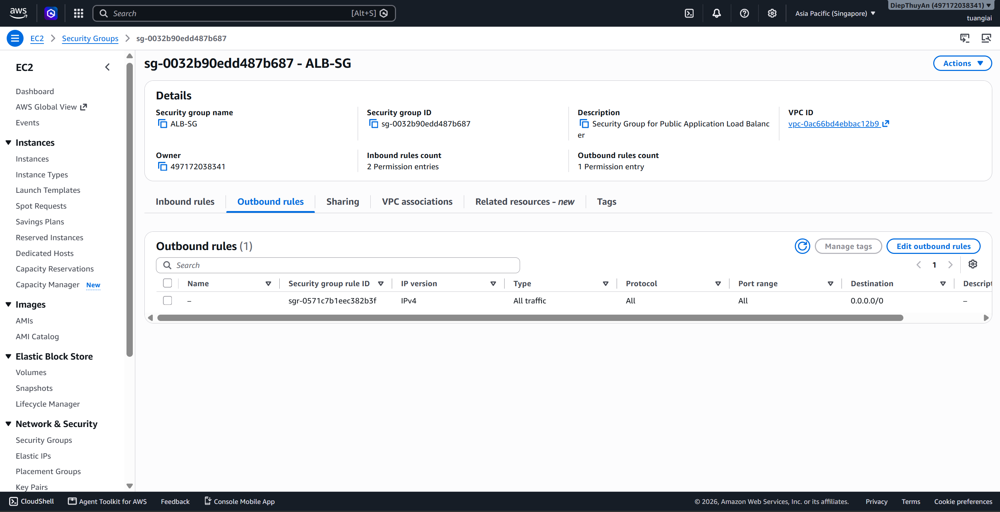
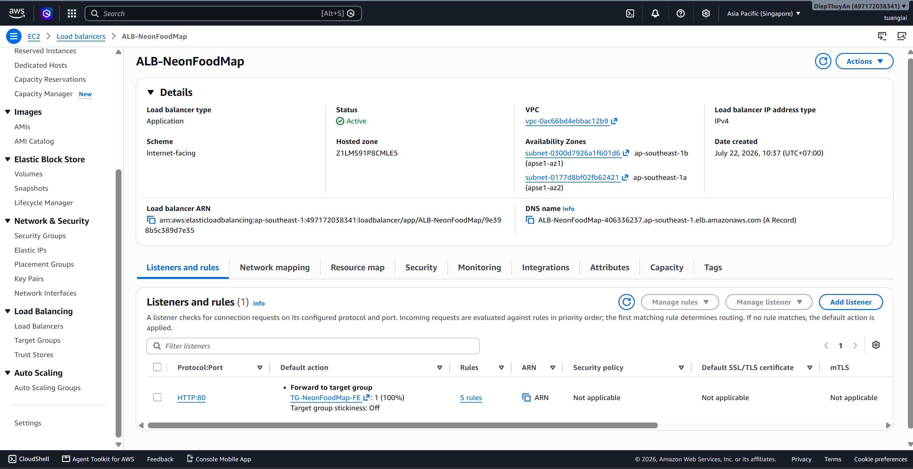
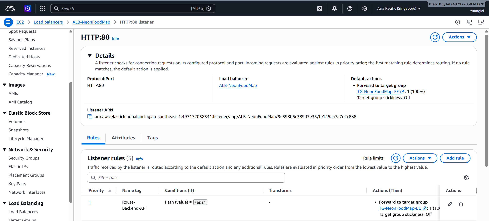

Application Load Balancer (ALB) phân phối traffic HTTP/HTTPS đến Backend ECS tasks, cung cấp health checking và SSL termination.

---

### 5.4.11.1. Tạo Security Group cho ALB

Security Group kiểm soát inbound/outbound traffic cho ALB.

1. Mở **EC2 Console** → **Security Groups**
2. Chọn **Create security group**
3. Thiết lập cấu hình:
   - **Name**: `alb-sg`
   - **Description**: `Security Group cho Public Application Load Balancer`
   - **VPC**: Chọn VPC dự án
4. Thêm **Inbound rules**:
   - Type: `HTTP`, Port: `80`, Source: `0.0.0.0/0`
   - Type: `HTTPS`, Port: `443`, Source: `0.0.0.0/0`
5. **Outbound rules**: Giữ mặc định (All traffic)
6. Chọn **Create security group**




---

### 5.4.11.2. Tạo Target Group cho Backend

Target Group định nghĩa nhóm targets (ECS tasks) mà ALB sẽ route traffic đến.

1. Mở **EC2 Console** → **Target Groups**
2. Chọn **Create target group**
3. Cấu hình **Basic configuration**:
   - **Target type**: `IP addresses` (cho Fargate tasks)
   - **Target group name**: `TG-NeonFoodMap-BE`
   - **Protocol**: `HTTP`
   - **Port**: `8000` (Django backend port)
   - **VPC**: Chọn VPC dự án

4. Cấu hình **Health checks**:
   - **Health check protocol**: `HTTP`
   - **Health check path**: `/api/health` hoặc `/admin/`
   - **Advanced health check settings**:
     - Healthy threshold: `2`
     - Unhealthy threshold: `2`
     - Timeout: `5 seconds`
     - Interval: `30 seconds`
     - Success codes: `200`

5. Chọn **Next**
6. Bước **Register targets**: Bỏ qua (ECS Service sẽ tự động đăng ký)
7. Chọn **Create target group**


---

### 5.4.11.3. Tạo Application Load Balancer

1. Mở **EC2 Console** → **Load Balancers**
2. Chọn **Create load balancer** → **Application Load Balancer**
3. Cấu hình **Basic configuration**:
   - **Load balancer name**: `ALB-NeonFoodMap`
   - **Scheme**: `Internet-facing`
   - **IP address type**: `IPv4`

4. Cấu hình **Network mapping**:
   - **VPC**: Chọn VPC dự án
   - **Mappings**: Chọn ít nhất 2 Availability Zones
   - Chọn **Public subnets** trong mỗi AZ

5. Cấu hình **Security groups**:
   - Chọn `alb-sg` đã tạo ở bước 5.4.11.1
   - Bỏ chọn default security group

6. Cấu hình **Listeners and routing**:
   - **Listener**: `HTTP` port `80`
   - **Default action**: Forward to `TG-NeonFoodMap-BE`

7. Xem lại cấu hình và chọn **Create load balancer**
8. Chờ ALB chuyển sang trạng thái `Active`


---

### 5.4.11.4. Cấu hình Listener Rules (Tùy chọn)

Nếu cần routing phức tạp hơn (ví dụ: path-based routing):

1. Mở **ALB** → **Listeners and rules**
2. Chọn listener `HTTP:80`
3. Chọn **Manage rules**
4. Chọn **Add rule**
5. Cấu hình rule:
   - **Name**: `route-backend-api`
   - **Condition**: Add condition → **Path** → `/api/*`
   - **Action**: Forward to → `TG-NeonFoodMap-BE`
   - **Priority**: `1`
6. Chọn **Save**




---

### Kiểm tra kết quả

Sau khi hoàn thành:

| Thành phần | Kết quả mong đợi |
|------------|------------------|
| Security Group | `alb-sg` với inbound HTTP/HTTPS |
| Target Group | `TG-NeonFoodMap-BE` với health check `/api/health` |
| ALB | `ALB-NeonFoodMap` ở trạng thái Active |
| Listener | HTTP:80 forward to Backend target group |
| DNS Name | ALB có DNS name dạng `*.elb.amazonaws.com` |

**Lấy ALB DNS name:**
```bash
# Lệnh CLI để lấy ALB DNS
aws elbv2 describe-load-balancers \
  --names ALB-NeonFoodMap \
  --query 'LoadBalancers[0].DNSName' \
  --output text
```

Sử dụng DNS name này để:
- Cấu hình Route 53 (nếu có custom domain)
- Test backend API: `http://<ALB-DNS>/api/health`
- Cấu hình trong ECS Service