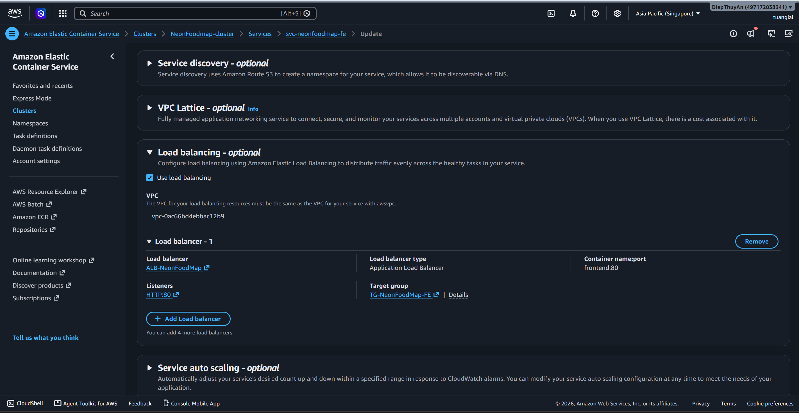

### 5.4.12.1. Link ECS Service with ALB

To allow ECS to automatically register tasks into the target group, configure load balancing within the ECS service.

1. Open the ECS Console.
2. Select the `neonfoodmap-cluster` cluster.
3. Select the frontend or backend service.
4. Edit or create a new service.
5. In the **Load balancing** section:
   - Select `Application Load Balancer`
   - Select `ALB-NeonFoodMap`
   - Select the corresponding container
   - Select listener `80:HTTP`
   - Select the corresponding target group
6. Save the changes.

Results:
- Backend

- Frontend

