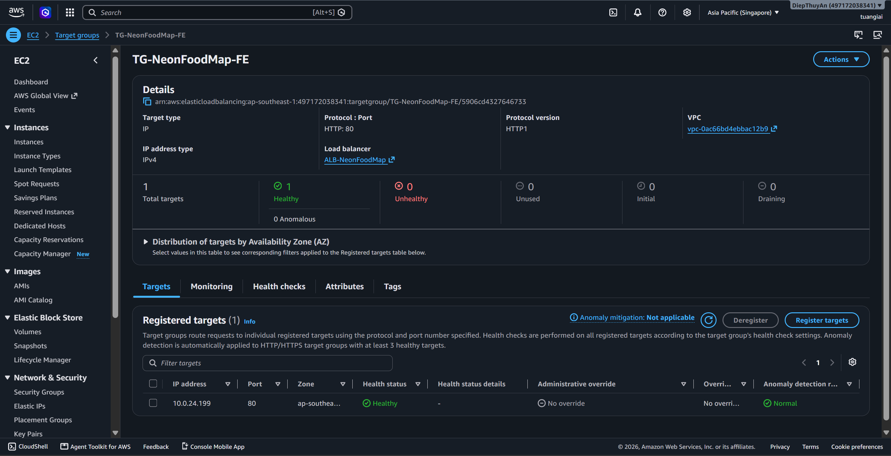
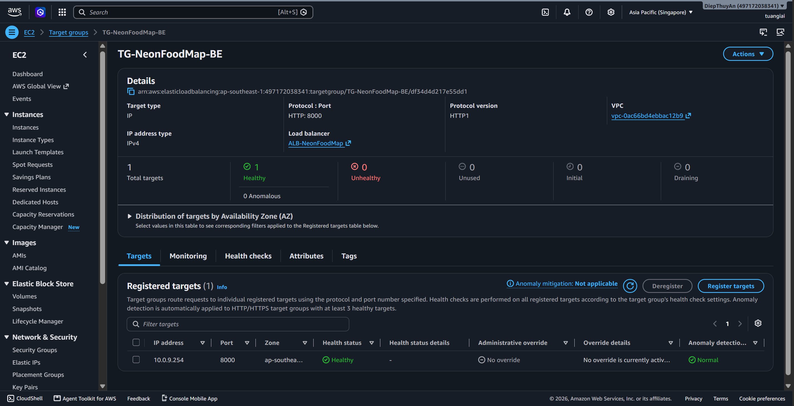
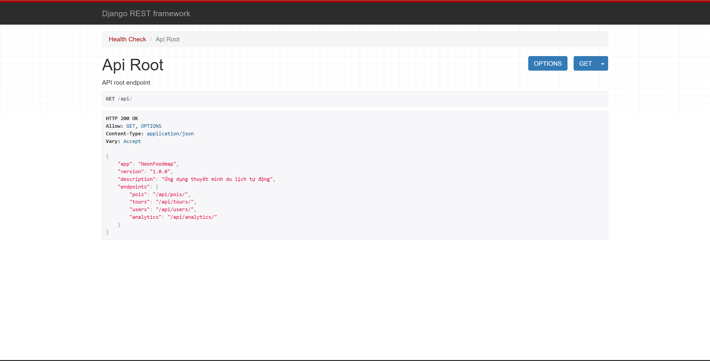

### 5.4.13.1. Health Checks and Smoke Tests Post-Deploy

After the ECS tasks are running, verify the status of the target groups.

Items to check:

- Frontend target group transitions to `Healthy`



- Backend target group transitions to `Healthy`



- The ALB DNS is accessible via browser
```
http://alb-neonfoodmap-406336237.ap-southeast-1.elb.amazonaws.com/map
```
- The `/api/...` endpoints return valid responses

```
http://alb-neonfoodmap-406336237.ap-southeast-1.elb.amazonaws.com/api/
```


