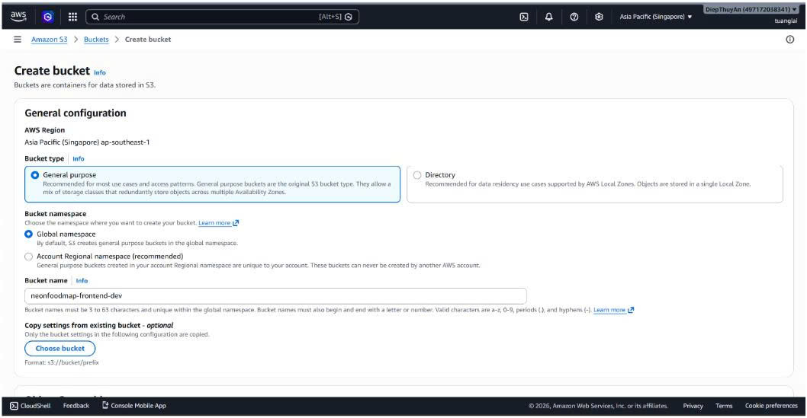
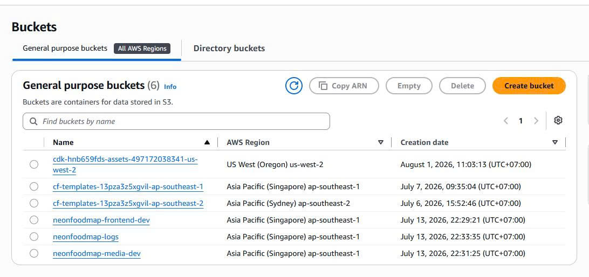
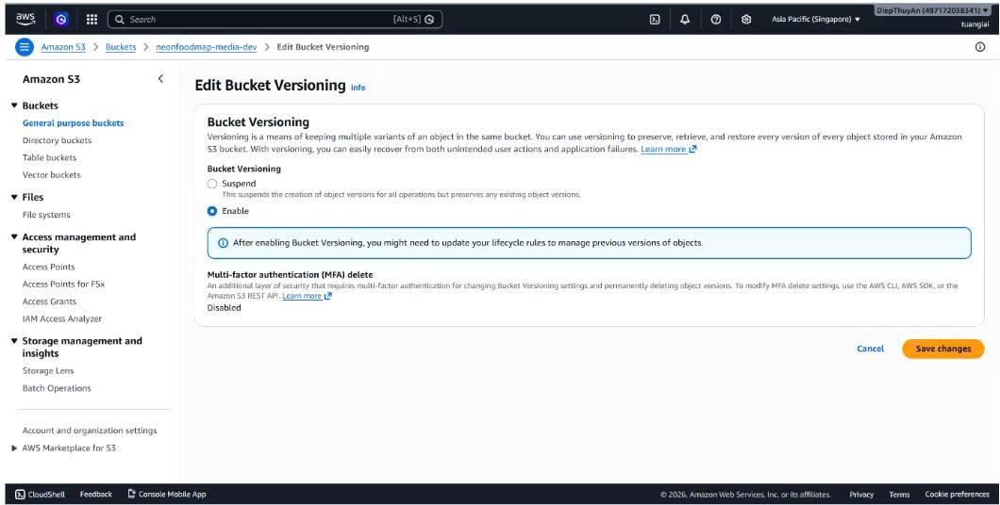
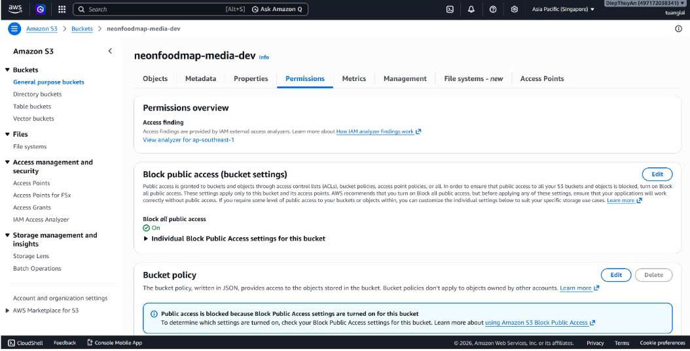
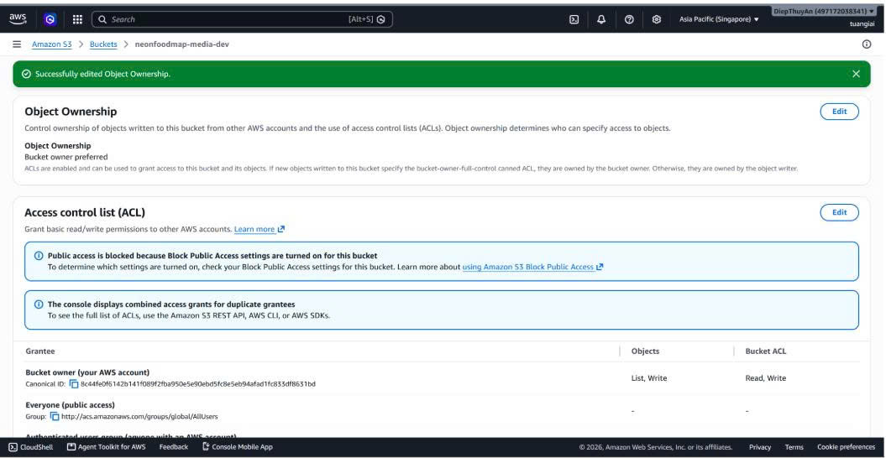
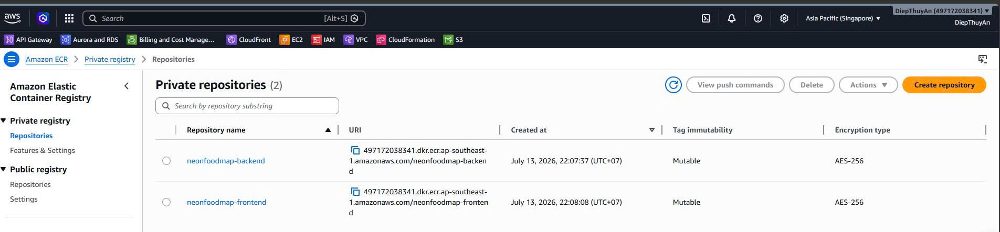
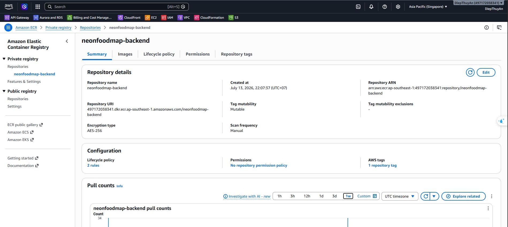
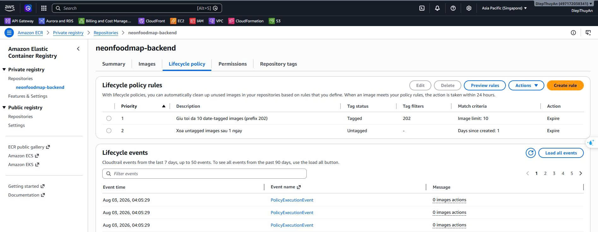
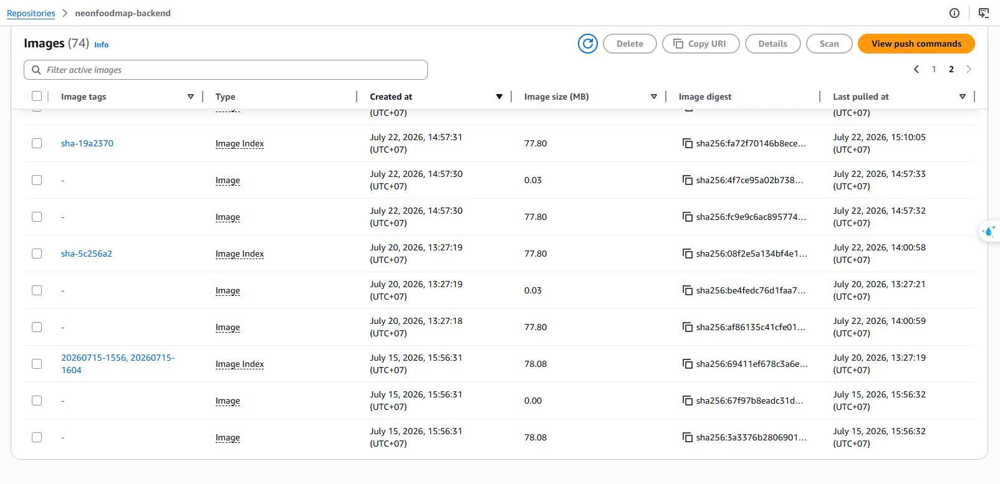

Trong phần này, nhóm tạo các Amazon S3 bucket theo từng loại dữ liệu, thiết lập Amazon ECR để lưu Docker image backend và kiểm tra image trước khi triển khai ECS. Quyền IAM/OIDC được trình bày tại [5.3 Kiến trúc hệ thống](../../5.3-Structure/).

## Tạo và cấu hình S3 bucket

### Tạo các bucket của dự án

1. Đăng nhập AWS Console tại Region `ap-southeast-1`, tìm **Amazon S3** và chọn **Buckets → Create bucket**.
2. Nhập tên theo quy ước `neonfoodmap-<mục-đích>-dev`: lần lượt tạo `neonfoodmap-frontend-dev`, `neonfoodmap-media-dev` và `neonfoodmap-logs-dev`. Chọn Region `ap-southeast-1` giống VPC, RDS và ECS để giảm độ trễ và chi phí truyền dữ liệu. 
3. Giữ **Block all public access** và default encryption **SSE-S3**. Các bucket không được mở public; chỉ IAM Role hoặc dịch vụ AWS được cấp quyền mới truy cập được.
4. Giữ các cấu hình còn lại mặc định, sau đó chọn **Create bucket**.

| Bucket                       | Mục đích                           | Versioning ban đầu        |
| ---------------------------- | ------------------------------------- | --------------------------- |
| `neonfoodmap-frontend-dev` | Lưu static asset React SPA build     | Disable                     |
| `neonfoodmap-media-dev`    | Lưu ảnh và tệp đa phương tiện | Enable ở bước tiếp theo |
| `neonfoodmap-logs-dev`     | Lưu log hệ thống dài hạn         | Disable                     |

Kiểm tra lại trang Buckets để xác nhận cả ba bucket đã được tạo thành công và ở đúng Region.



### Bật Versioning cho media bucket

1. Tại **S3 → Buckets**, chọn `neonfoodmap-media-dev`.
2. Mở tab **Properties**, tìm **Bucket Versioning** → **Edit** → chọn **Enable** → **Save changes**.

Bucket frontend được dùng để lưu static assets của React SPA. Bucket logs giữ Versioning ở trạng thái Disable vì chưa có yêu cầu lưu nhiều phiên bản. Việc bật Versioning cho media giúp hỗ trợ khôi phục object khi bị ghi đè hoặc xóa nhầm mà vẫn hạn chế chi phí lưu trữ không cần thiết.



### Kiểm tra public access và Object Ownership

Lần lượt mở từng bucket → tab **Permissions**. Tại **Block public access**, đảm bảo bốn tùy chọn chặn public access được bật. Khi phân phối frontend qua CloudFront, không cần mở bucket public mà dùng **Origin Access Control (OAC)** để CloudFront đọc object trong S3 thông qua bucket policy.





## Tạo ECR repositories

**Mục đích:** Tạo private repository trên Amazon ECR để lưu Docker image backend trước khi triển khai ECS Fargate.

### Tạo repository

1. Mở PowerShell tại thư mục `aws_04_deploy` của dự án.
2. Chạy script:

```powershell
.\01_create_ecr_repos.ps1
```

3. Nhập MFA khi script yêu cầu. Script lấy STS session token, kiểm tra repository đã tồn tại rồi chỉ tạo repository còn thiếu; vì vậy có thể chạy lại an toàn.
4. Repository được cấu hình scan on push, encryption AES-256 và tag quản lý dự án. Mở **Amazon ECR → Private repositories** để kiểm tra kết quả.

| Repository | URI mong đợi                                                                 |
| ---------- | ------------------------------------------------------------------------------ |
| Backend    | `<AWS_ACCOUNT_ID>.dkr.ecr.ap-southeast-1.amazonaws.com/neonfoodmap-backend`  |

Kiểm tra AWS credential

Sau khi cấu hình AWS CLI và lấy session token qua MFA, kiểm tra identity đang sử dụng:

```powershell
aws sts get-caller-identity
```

Lệnh phải trả về đúng AWS account đang triển khai và ARN của IAM User/Role hợp lệ.

### Lấy ECR password và Docker login

Chuỗi xác thực là: AWS profile → MFA code → STS session token → `aws ecr get-login-password` → Docker login. Thiết lập registry theo account của nhóm rồi chạy lệnh pipe trực tiếp từ AWS CLI sang Docker:

```powershell
$registry = "<AWS_ACCOUNT_ID>.dkr.ecr.ap-southeast-1.amazonaws.com"
aws ecr get-login-password --region ap-southeast-1 |
  docker login --username AWS --password-stdin $registry
```

### Test ECR login

Chạy script kiểm tra toàn bộ chuỗi xác thực:

```powershell
.\02_test_ecr_login.ps1
```

| Bước kiểm tra | Kết quả PASS                                                             |
| ---------------- | -------------------------------------------------------------------------- |
| Docker daemon    | Docker Desktop/Engine đang chạy                                          |
| AWS CLI          | Profile được cấu hình và`aws sts get-caller-identity` thành công |
| MFA và STS      | MFA hợp lệ, nhận được session token tạm thời                       |
| ECR password     | `aws ecr get-login-password` trả password hợp lệ                      |
| Docker login     | Docker login vào ECR thành công                                         |





## Build Docker image

### Backend: Django và Gunicorn

Backend dùng multi-stage Dockerfile: `python:3.12-slim` builder cài dependency, runtime chỉ giữ thư viện cần thiết. Container chạy bằng `appuser`, phục vụ Gunicorn tại port `8000`. Migration được chạy một lần bằng ECS one-off task trước deploy để tránh nhiều replica chạy migration đồng thời.

```powershell
.\03_build_backend.ps1
```

Script tạo tag `neonfoodmap-backend:latest` và timestamp tag, sau đó kiểm tra Django import, Gunicorn, cấu trúc app, `mysqlclient`/Pillow và Django management command.


## Kiểm tra local, push và lifecycle

1. Chạy kiểm tra toàn diện backend image:

```powershell
.\05_test_builds_local.ps1
```

Backend chạy non-root, không chứa các thư viện không cần thiết trong image cuối.

2. Push image đã pass test:

```powershell
.\06_push_ecr.ps1
```

Script tag/push `latest` và timestamp/commit tag, sau đó đối chiếu digest. Tiếp tục chạy `.\07_test_pull_ecr.ps1` để xóa cache, pull lại image từ ECR và smoke test.

3. Áp dụng ECR lifecycle policy:

```powershell
.\08_ecr_lifecycle.ps1
```

Policy giữ tối đa 10 date-tagged image, xóa untagged image sau một ngày và giữ tag `latest`. Có thể chạy `-DryRun` để kiểm tra trước khi apply.



**Kiểm tra các images đã đẩy lên thành công ECR**


