After Docker images are available in Amazon ECR, this stage deploys **NeonFoodMap** to Amazon ECS Fargate. GitHub Actions checks source code, builds and pushes images, and requests AWS access through OIDC. ECS runs separate frontend and backend containers in private subnets, while an Application Load Balancer (ALB) accepts Internet traffic and routes it to the services.

## Create the GitHub OIDC identity provider

GitHub Actions needs an **identity provider** to exchange its token for temporary **AWS STS** credentials.

1. Open **Identity and Access Management (IAM)**. Select **Access management → Identity providers → Add provider**.
2. Choose **OpenID Connect** and enter:

| Field        | Value                                           |
| ------------ | ----------------------------------------------- |
| Provider URL | `https://token.actions.githubusercontent.com` |
| Audience     | `sts.amazonaws.com`                           |


After creation, confirm that the provider uses `https://token.actions.githubusercontent.com`. It validates token identity only; actual deployment permissions are granted by the IAM role in the next step.


## Create the GitHub Actions IAM role

`NeonFoodmap-GitHub-Actions-Role` lets the workflow get temporary permissions. It uses **Web identity**, never an IAM user access key or secret key.

1. In IAM, select **Access management → Roles → Create role**.
2. Select **Web identity**, choose the GitHub OIDC provider, and set audience to `sts.amazonaws.com`.


3. Attach only the permissions needed to push ECR images and update ECS.


4. Open the new role, select **Trust relationships → Edit trust policy**, and check both the audience and repository identity. For production, limit the token to the `main` branch:

```json
{
  "token.actions.githubusercontent.com:aud": "sts.amazonaws.com",
  "token.actions.githubusercontent.com:sub": "repo:HaoWasabi/NeonFoodmap:ref:refs/heads/main"
}
```

5. Save the policy and review the trusted entity.


## CI/CD workflow with GitHub Actions

NeonFoodMap combines **Continuous Integration (CI)** and **Continuous Deployment (CD)** in one workflow: **`deploy.yml`**. The report separates the two phases below for clarity; the repository still uses only one workflow file.

### CI — Source-code checks

CI runs for pull requests to `main` and for pushes to `main`, `develop`, or `feature/**` that change the frontend or backend:

- **Backend:** runs `flake8` and Django unit tests.
- **Frontend:** runs `npm ci`, ESLint, and the production build.
- **E2E:** after the frontend check passes, Playwright runs the `critical` test suite and retains its report for 7 days.

The pipeline can build deployment images only after both the backend and E2E checks pass.

### CD — Build and deployment

CD runs only when a push reaches **`main`** and all CI checks have passed:

- GitHub Actions uses OIDC to authenticate with AWS, then builds and pushes backend and frontend images to Amazon ECR with `latest` and `sha-<git-short-sha>` tags.
- Two deployment jobs run in parallel: they update the task definitions and deploy `svc-neonfoodmap-be` and `svc-neonfoodmap-fe` to ECS. The backend job also runs migrations and verifies the RDS connection.
- After both services stabilize, smoke tests call the root API plus `/api/pois/`, `/api/tours/`, and `/api/categories/`; the pipeline fails on an HTTP 5xx response.

**Workflow: `deploy.yml` — automatic deployment on pushes to `main`**

```text
backend-test ─────┐
                  ├──▶ build-and-push ──┬──▶ deploy-backend  ──┐
frontend-check ──▶ e2e-tests ───────────┘                      ├──▶ smoke-tests
                                             └──▶ deploy-frontend ─┘
```

## Create the ECS cluster and task definitions

NeonFoodMap uses **Amazon ECS Fargate**, so the team manages containers and task configuration instead of EC2 hosts. Backend and frontend use separate task definitions for independent updates, logs, and permissions.

### Create a service-discovery namespace

Before creating the cluster, register a private **AWS Cloud Map** namespace. It gives services stable private DNS names in the VPC instead of changing Fargate task IP addresses.

1. Open **AWS Cloud Map** and select **Create namespace**.
2. Set the namespace name to `NeonFoodmap.internal` and the description to `Use for internal API Calls and DNS`.
3. For **Instance discovery**, select **API calls and DNS queries in VPCs**, then select the `NeonFoodmap` VPC.
4. Keep the default `20 seconds` TTL and create the namespace.

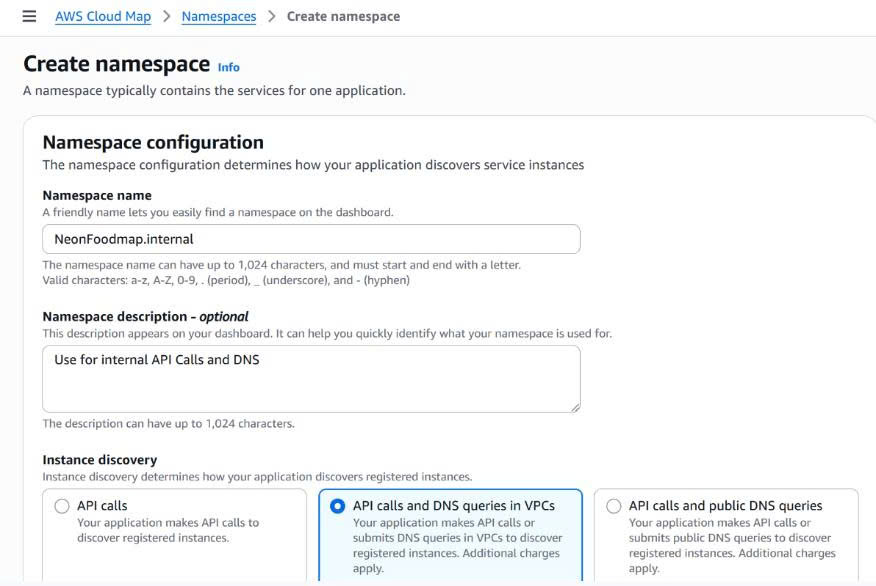

### Create Cloud Map services

In `NeonFoodmap.internal`, select **Create service**.

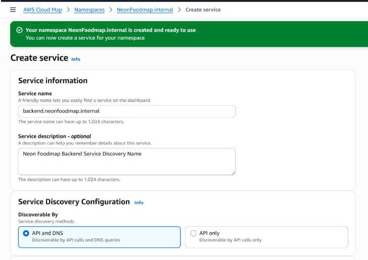

| Setting        | Backend                                         | Frontend                                          |
| -------------- | ----------------------------------------------- | ------------------------------------------------- |
| Service name   | `backend` → `backend.neonfoodmap.internal` | `frontend` → `frontend.neonfoodmap.internal` |
| Description    | Neon Foodmap Backend Service Discovery Name     | Neon Foodmap Frontend Service Discovery Name      |
| Routing policy | `WEIGHTED`                                    | `WEIGHTED`                                      |
| Record type    | `A`                                           | `A`                                             |
| DNS TTL        | `300` seconds                                 | `300` seconds                                   |
| Health check   | No health check                                 | No health check                                   |

ECS registers and deregisters these records with each task lifecycle. The ALB target groups created later handle public-traffic health checks.

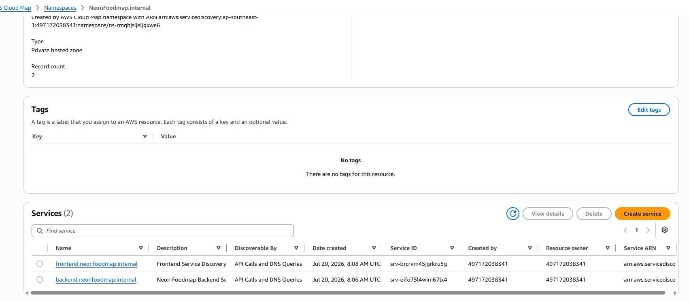

### Create the ECS cluster

1. Open **Amazon ECS**, choose **Clusters**, and select **Create cluster**.
2. Name it `NeonFoodmap-cluster` and use serverless **AWS Fargate**.
3. Choose the service discovery prepared above.

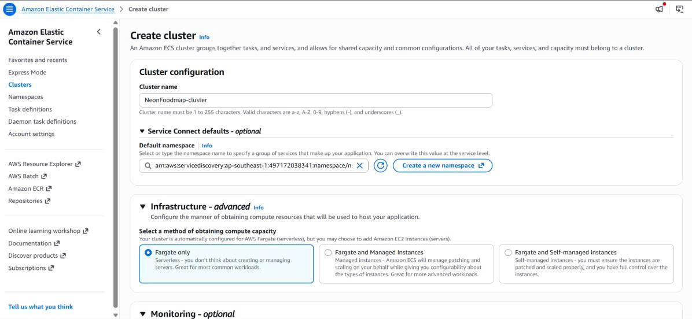

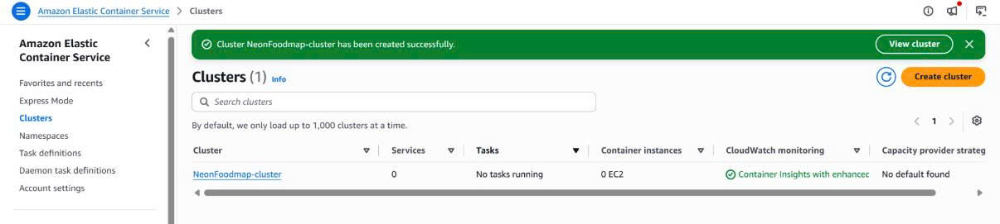

### Create backend and frontend task definitions

1. In ECS, select **Task definitions → Create new task definition**.
2. Select **AWS Fargate**, **Linux/X86_64**, and set the task definition family to `neonfoodmap-task-be`.

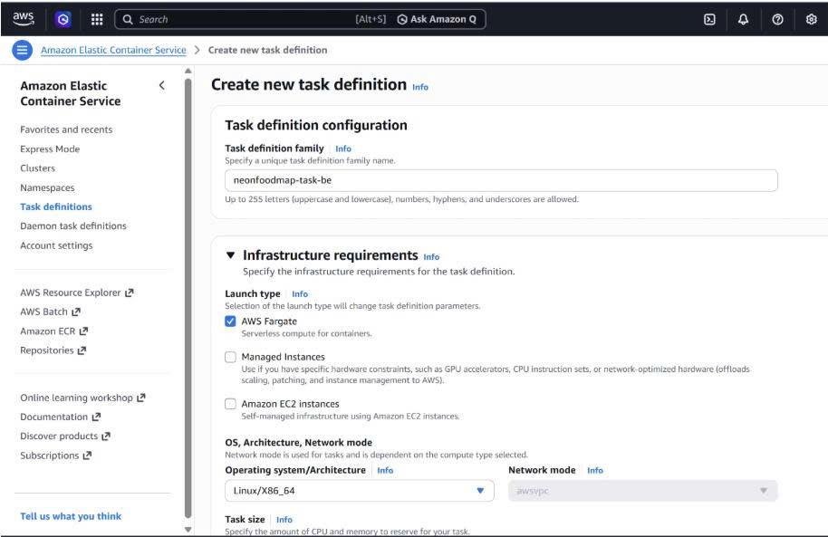

3. Set **Task CPU** to `256` and **Task memory** to `512 MiB`. Attach `NeonFoodmap-ECS-TaskExecution-Role` as the **task execution role** for ECR pulls and CloudWatch logging. Attach `NeonFoodmap-ECS-Backend-Role` as the **task role** for backend application permissions.
4. Add the backend container from the `neonfoodmap-backend` ECR repository, with TCP container port `8000`.


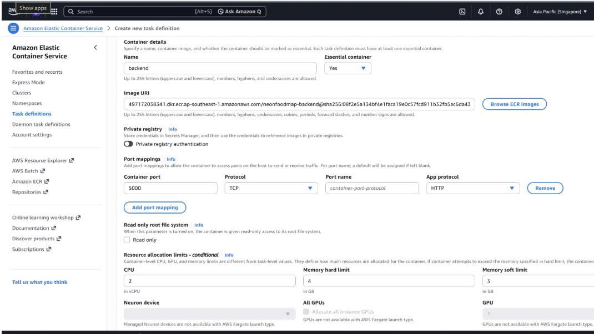

5. Add required variables to the task definition. For sensitive passwords, use **ValueFrom** to read AWS Secrets Manager.


6. Use **CloudWatch Logs**, create or select `/ecs/neonfoodmap-backend` in `ap-southeast-1`, and set retention according to the project policy.

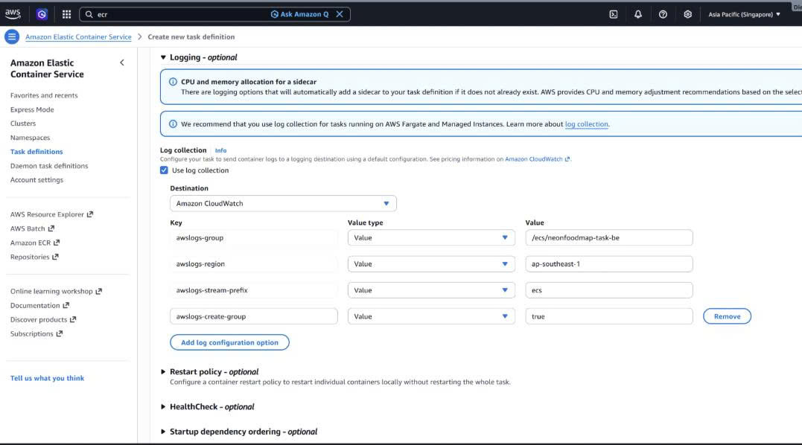

7. Select **Create** to register the revision.


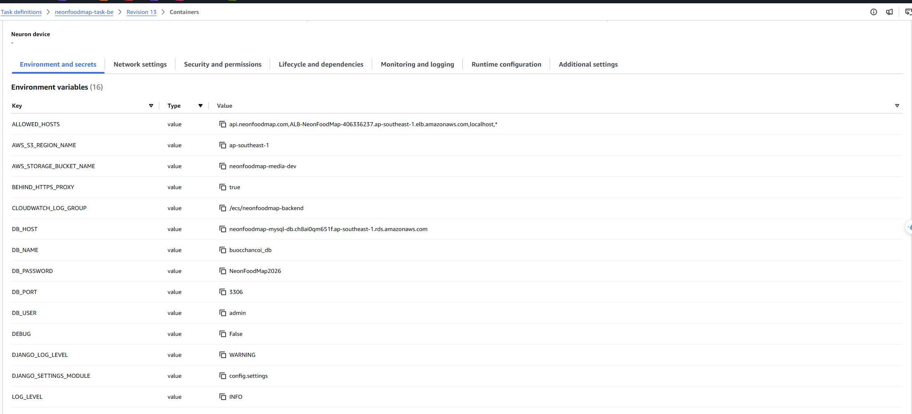

### Frontend task definition

Repeat the process for the frontend. Separate task definitions mean the frontend can deploy without making a new backend revision, and vice versa.

| Configuration        | Backend                      | Frontend                      |
| -------------------- | ---------------------------- | ----------------------------- |
| Task family          | `neonfoodmap-task-be`      | `neonfoodmap-task-fe`       |
| ECR image            | `neonfoodmap-backend`      | `neonfoodmap-frontend`      |
| Container port       | `8000`                     | `80`                        |
| CPU / memory         | `256` / `512 MiB`        | `256` / `512 MiB`         |
| CloudWatch log group | `/ecs/neonfoodmap-backend` | `/ecs/neonfoodmap-frontend` |

For the frontend, select `neonfoodmap-frontend`, set port `80`, and use `/ecs/neonfoodmap-frontend`.

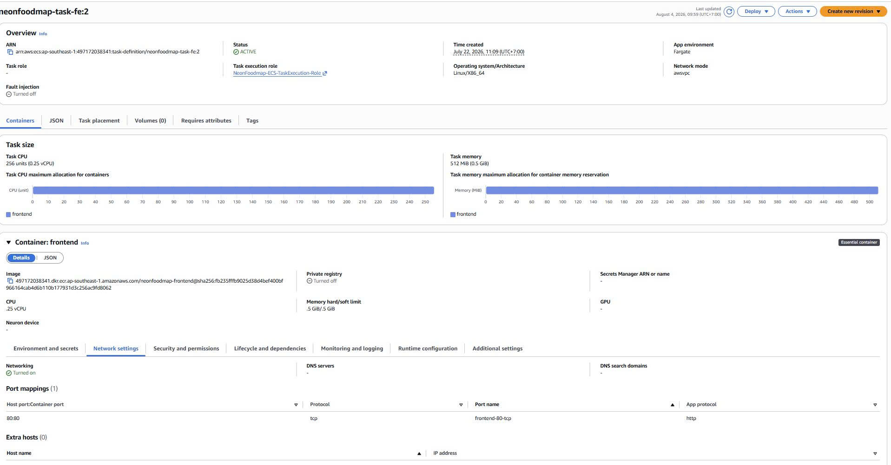

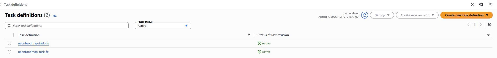

## Create the Application Load Balancer

The ALB is placed in two public subnets. It accepts Internet traffic and forwards it only to ECS tasks in private subnets, so the frontend and backend are not directly exposed.

### Create the ALB security group

1. Open **EC2 → Security Groups → Create security group**.
2. Name it `alb-sg`, describe it as *Security Group for Public Application Load Balancer*, and select the project VPC.
3. Add inbound rules: **HTTP / 80 / Anywhere-IPv4 (`0.0.0.0/0`)** and **HTTPS / 443 / Anywhere-IPv4 (`0.0.0.0/0`)**.

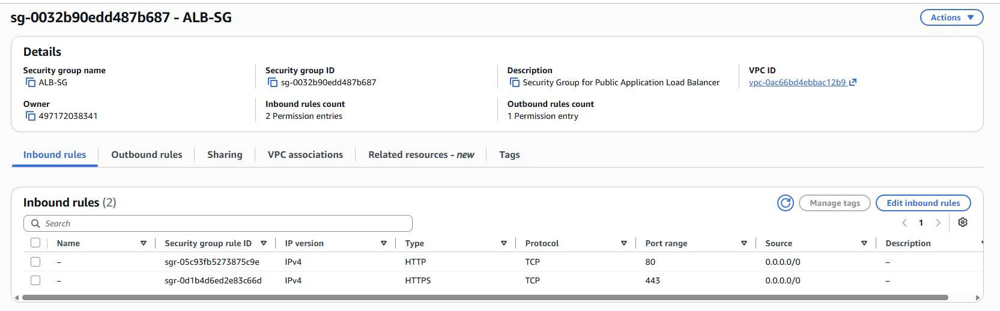

4. Keep the default outbound rule so the ALB can send requests to ECS tasks, then create the security group.

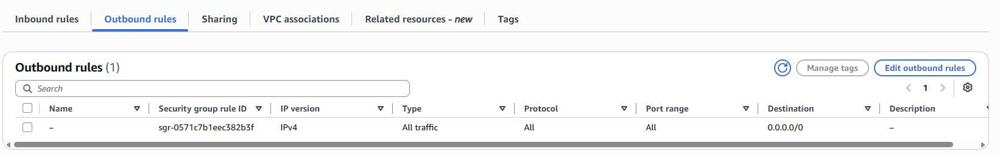

The ECS task security group works in the opposite direction: allow frontend port `80` and backend port `8000` only when the source is `alb-sg`. Do not open these ports to `0.0.0.0/0`.

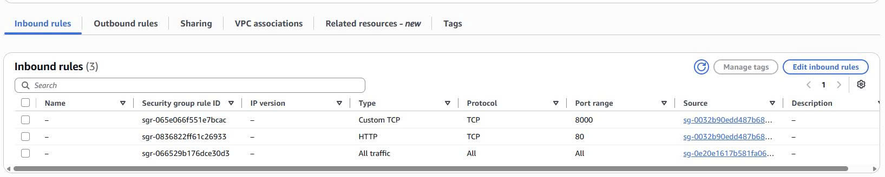

### Create target groups and health checks

Fargate gives tasks private IP addresses, so both target groups must use **Target type: IP addresses**. Do not register IPs manually; ECS registers and deregisters task IPs during deployment.

1. Go to **EC2 → Target Groups → Create target group** and create the frontend target group:


| Field                         | Frontend value         |
| ----------------------------- | ---------------------- |
| Target group name             | `TG-NeonFoodMap-FE`  |
| Target type                   | **IP addresses** |
| Protocol / port               | HTTP /`80`           |
| Health check path             | `/`                  |
| Healthy / unhealthy threshold | `2` / `2`          |
| Health check interval         | `30 seconds`         |

2. Select **Next**, skip manual IP registration, and select **Create target group**.

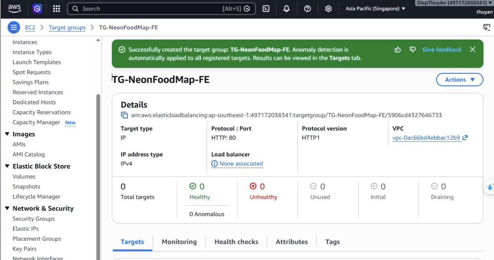

3. Create the backend target group. Its health check path must match a real Django endpoint:

| Field                         | Backend value          |
| ----------------------------- | ---------------------- |
| Target group name             | `TG-NeonFoodMap-BE`  |
| Target type                   | **IP addresses** |
| Protocol / port               | HTTP /`8000`         |
| Health check path             | `/api/health/`       |
| Healthy / unhealthy threshold | `2` / `2`          |
| Health check interval         | `30 seconds`         |

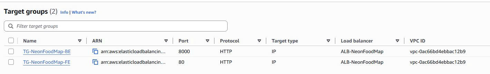

### Create the ALB and listener

1. Go to **EC2 → Load Balancers → Create load balancer** and choose **Application Load Balancer**.
2. Name it `ALB-NeonFoodMap`, choose **Internet-facing** and IPv4.

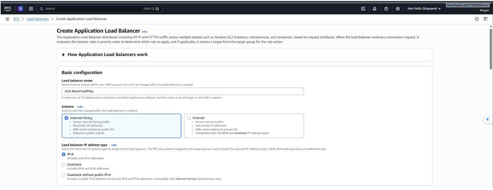

3. Select the project VPC. In **Network mapping**, select both Availability Zones and both public subnets with routes to the Internet Gateway.

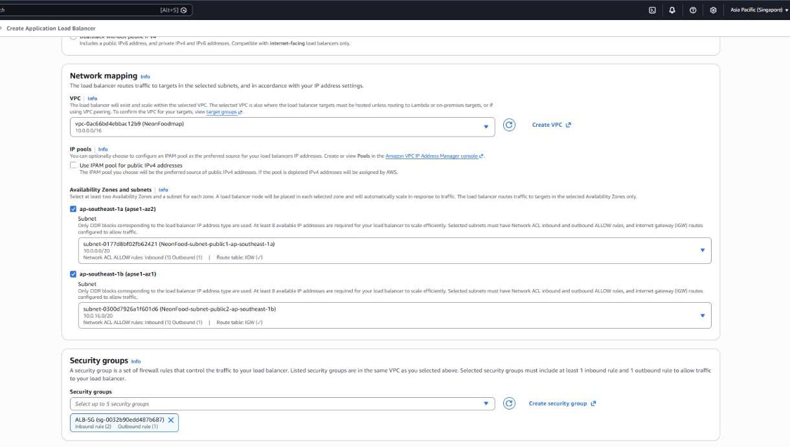

4. Remove the default security group and select `alb-sg`.
5. Create the **HTTP : 80** listener. For the default action, forward to `TG-NeonFoodMap-FE`, then create the load balancer.


### Add the API routing rule

1. Select `ALB-NeonFoodMap`, open **Listeners and rules**, and select **HTTP:80**.
2. Select **Add rule**. Name it `route-backend-api` and add a **Path** condition with `/api/*`.
3. Forward the action to `TG-NeonFoodMap-BE`, choose a priority such as `10`, and save.

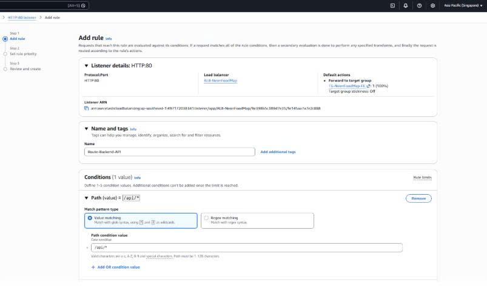

Normal requests now go to the frontend target group; `/api/*` goes to the backend target group. For HTTPS, add a listener on `443` with an ACM certificate and redirect listener `80` to HTTPS.


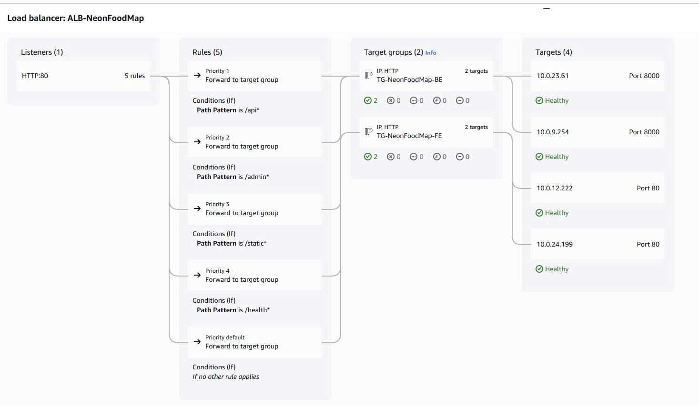

## Create ECS services and attach target groups

After task definitions, target groups, and the ALB are ready, create each ECS service. ECS then manages task lifecycle and registers private IP addresses in the correct target group.

### Create the backend service

1. Open **ECS → Clusters → NeonFoodmap-cluster → Create service**.
2. Choose task definition family `neonfoodmap-task-be`, service name `svc-neonfoodmap-be`, and **Task definition revision latest**.


3. Under networking, select the VPC, the application's **private subnets**, and the ECS task security group.


4. Under **Load balancing**, choose `ALB-NeonFoodMap`, existing listener `80:HTTP`, backend container port `8000`, and existing target group `TG-NeonFoodMap-BE`.

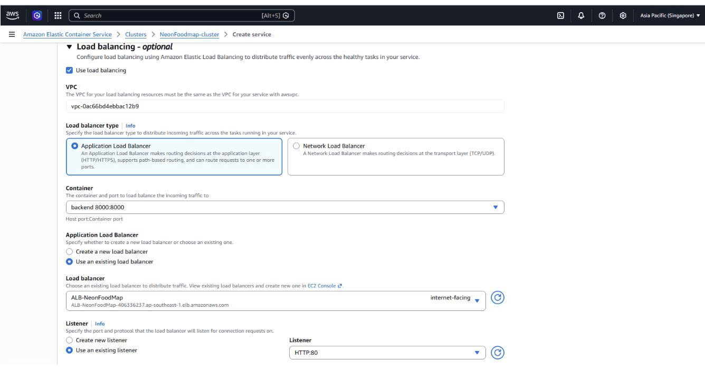

5. Review the configuration and select **Create**. ECS creates tasks and registers task IPs with the backend target group and Cloud Map.


### Create the frontend service

Repeat the service process for the frontend: choose `neonfoodmap-task-fe`, name the service `svc-neonfoodmap-fe`, select private subnets and the ECS task security group. Under **Load balancing**, select `ALB-NeonFoodMap`, listener `80:HTTP`, frontend container port `80`, and target group `TG-NeonFoodMap-FE`.

ECS performs a rolling deployment. Keep enough healthy tasks available so the ALB does not send traffic to a task that is not ready.


