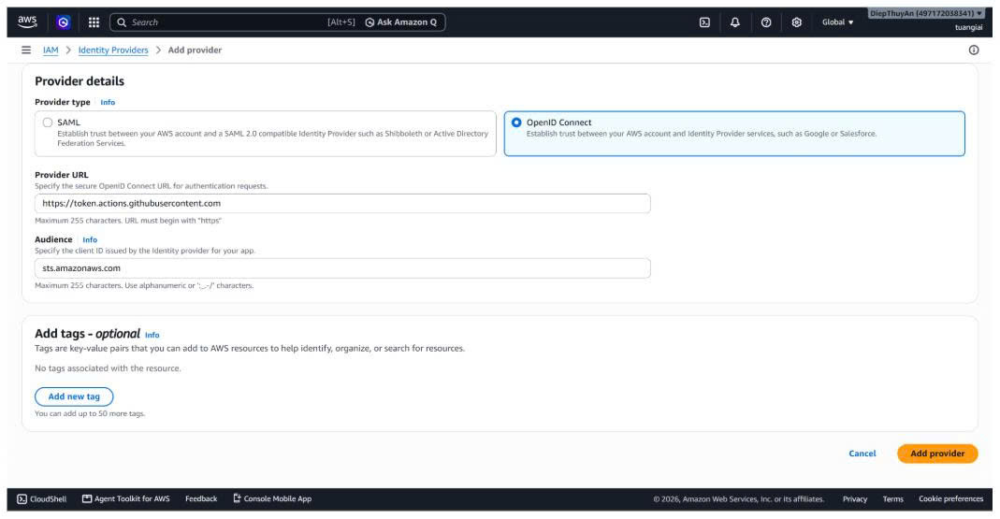
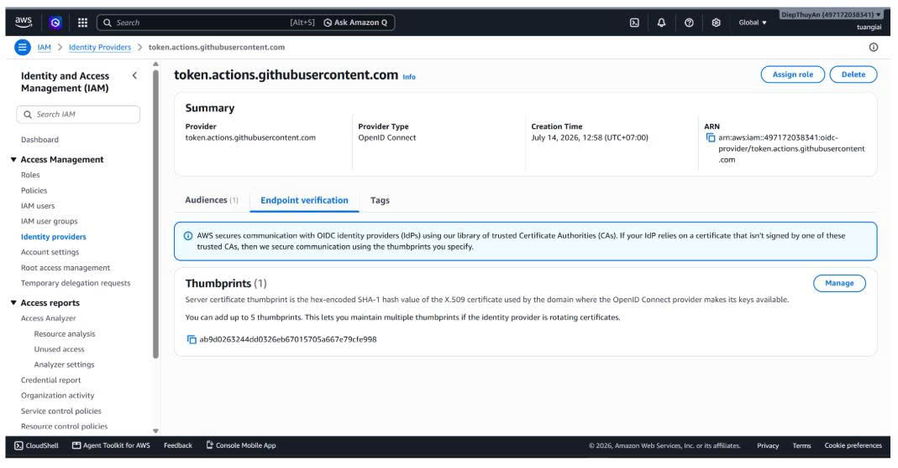
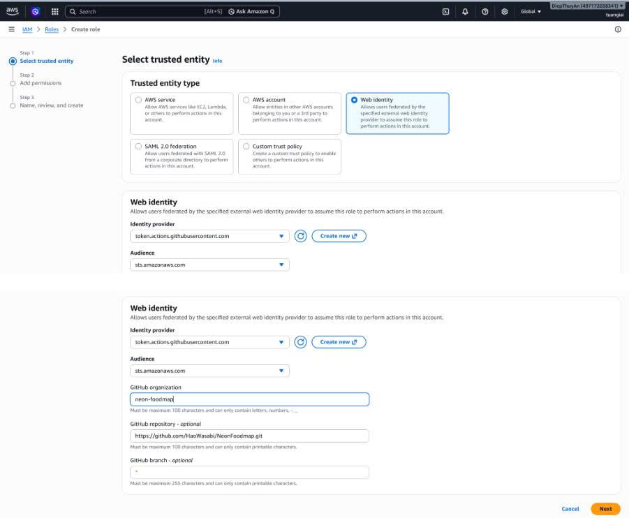
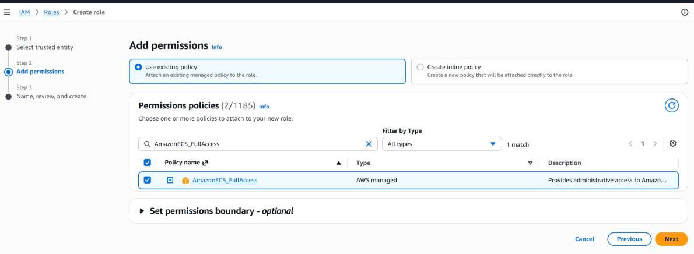
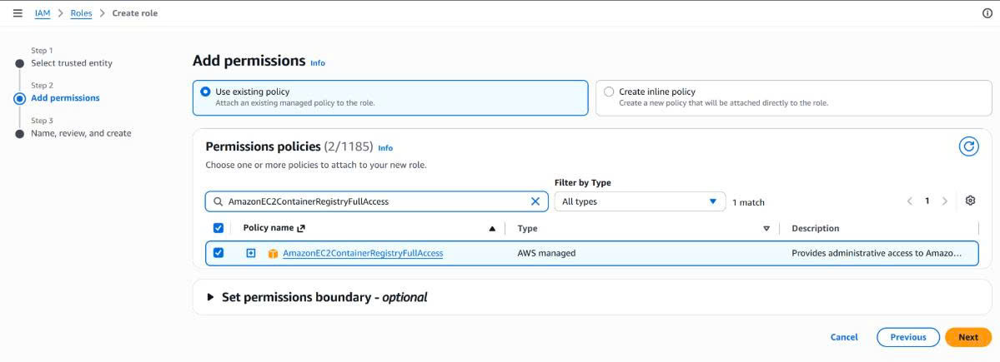
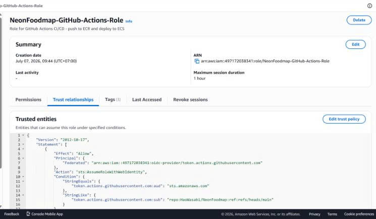
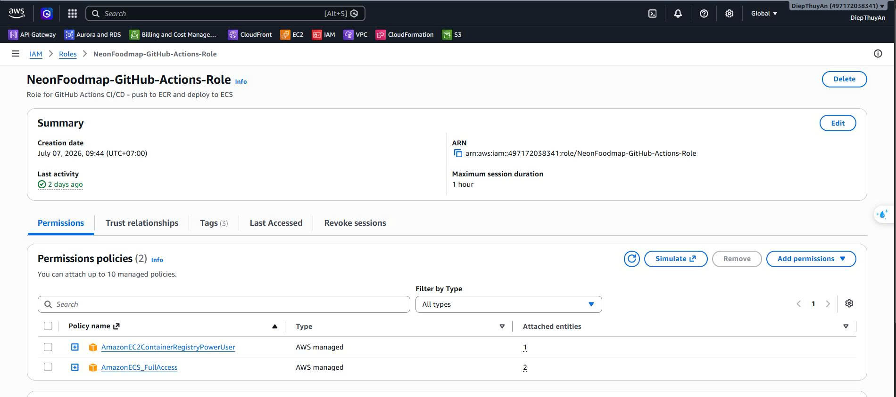

Mục này tập trung vào **GitHub Actions**: xác thực OIDC, khai báo Secrets/Variables và workflow CI/CD. Phần Amazon ECS Fargate và Application Load Balancer được tách sang [mục 5.4.4](../5.4.4-ecs-autoscaling/).

## Tạo GitHub OIDC Identity Provider

GitHub Actions cần **Identity Provider** để đổi token GitHub phát hành thành temporary credential của **AWS STS**.

1. Vào **IAM → Identity providers** và chọn **Add provider**.
2. Chọn **OpenID Connect**, sau đó điền:

| Trường     | Giá trị                                       |
| ------------ | ----------------------------------------------- |
| Provider URL | `https://token.actions.githubusercontent.com` |
| Audience     | `sts.amazonaws.com`                           |





## Tạo IAM Role cho GitHub Actions

Role `NeonFoodmap-GitHub-Actions-Role` cho phép workflow lấy quyền tạm thời qua **Web identity**, không dùng access key/secret key của IAM User.

1. Trong **IAM → Roles**, chọn **Create role**.
2. Chọn **Web identity**, GitHub OIDC Provider vừa tạo và audience `sts.amazonaws.com`. 
3. Chỉ gắn quyền cần thiết để push image ECR, đăng ký task definition, chạy migration task và cập nhật ECS service.  
4. Trong **Trust relationships → Edit trust policy**, giới hạn token production cho repository và nhánh `main`:

```json
{
  "token.actions.githubusercontent.com:aud": "sts.amazonaws.com",
  "token.actions.githubusercontent.com:sub": "repo:HaoWasabi/NeonFoodmap:ref:refs/heads/main"
}
```





## Lấy file workflow

| Mục            | Giá trị                                                                                                   |
| --------------- | ----------------------------------------------------------------------------------------------------------- |
| Đường dẫn   | `.github/workflows/deploy.yml`                                                                            |
| URL tham chiếu | [GitHub Actions deploy.yml](https://github.com/HaoWasabi/NeonFoodmap/blob/main/.github/workflows/deploy.yml) |

```text
backend-test ─────┐
                  ├──▶ build-backend ──▶ deploy-backend ──▶ smoke-tests
frontend-build ───┤                    │
                  └──▶ deploy-frontend ─┘
```

Truy cập kho mã nguồn GitHub để tải hoặc kiểm tra file này. Chỉ bản ghi được push hoặc merge vào `main` mới được phép triển khai production.

## Khai báo GitHub Secrets và Variables

Trong repository, vào **Settings → Secrets and variables → Actions**. Có thể đặt giá trị deploy trong Environment `production` để áp dụng approval trước khi chạy.

### GitHub Secrets

| Secret           | Giá trị / mục đích                                                       |
| ---------------- | ----------------------------------------------------------------------------- |
| `AWS_ROLE_ARN` | ARN của`NeonFoodmap-GitHub-Actions-Role`, dùng để Assume Role qua OIDC. |

### GitHub Variables

| Variable                      | Giá trị mẫu            | Mục đích                                      |
| ----------------------------- | ------------------------- | ------------------------------------------------ |
| `AWS_REGION`                | `ap-southeast-1`        | Region AWS cho ECR, ECS và S3.                 |
| `ECR_BACKEND_REPOSITORY`    | `neonfoodmap-backend`   | Repository ECR backend.                          |
| `S3_FRONTEND_BUCKET`        | `neonfoodmap-frontend-dev` | S3 bucket lưu frontend static build.        |
| `CLOUDFRONT_DISTRIBUTION_ID` | `E1234567890ABC`       | CloudFront distribution ID để invalidate cache. |
| `ECS_CLUSTER`               | `NeonFoodmap-cluster`   | ECS cluster nhận bản triển khai backend.    |
| `ECS_BACKEND_SERVICE`       | `svc-neonfoodmap-be`    | ECS service backend được cập nhật.          |
| `BACKEND_TASK_DEFINITION`   | `neonfoodmap-task-be`   | Family backend task definition.                  |
| `MIGRATION_TASK_DEFINITION` | `neonfoodmap-task-be`   | Task definition của Fargate task migration.     |
| `SMOKE_TEST_BASE_URL`       | `http://<alb-dns-name>` | URL gốc cho smoke test sau deploy backend.      |

Workflow tham chiếu bằng `secrets.AWS_ROLE_ARN` và `vars.<TÊN_VARIABLE>`. Password database và `DJANGO_SECRET_KEY` không đặt trong workflow; ECS task phải đọc chúng từ AWS Secrets Manager.

## Chi tiết các job trong pipeline

### Job 1: `backend-test` — Backend Lint & Unit Test

| Mục          | Chi tiết                                                        |
| ------------- | ---------------------------------------------------------------- |
| Trigger       | Push/PR có thay đổi thuộc`backend/**`                      |
| Runner        | `ubuntu-latest`                                                |
| Môi trường | Python 3.12, bật pip cache                                      |
| Linting       | `flake8`; lỗi `E9`, `F63`, `F7`, `F82` chặn pipeline |
| Testing       | `python manage.py test --settings=config.settings_test`        |
| Database      | SQLite in-memory, không cần MySQL thật                        |

### Job 2: `frontend-build` — Frontend Build Static Assets

| Mục          | Chi tiết                                                   |
| ------------- | ----------------------------------------------------------- |
| Trigger       | Push/PR có thay đổi thuộc`frontend/**`                |
| Runner        | `ubuntu-latest`                                           |
| Môi trường | Node.js 22, bật npm cache                                  |
| Linting       | `npm run lint` (ESLint)                                   |
| Building      | `npm run build` (Vite production build static assets)     |
| Output        | Tạo thư mục`dist/` chứa HTML, JS, CSS cho S3/CloudFront |

### Job 3: `build-backend` — Build & Push Backend Docker Image

| Mục           | Chi tiết                                                   |
| -------------- | ----------------------------------------------------------- |
| Phụ thuộc    | `backend-test` phải Pass                                 |
| Điều kiện   | Chỉ chạy khi push trực tiếp hoặc merge vào`main`    |
| Xác thực AWS | Dùng OIDC để Assume Role qua`AWS_ROLE_ARN`             |
| Build          | Docker build backend image với multi-stage Dockerfile      |
| Push to ECR    | Push image với tag`latest` và `sha-<7_ký_tự_commit>` |
| Caching        | GitHub Actions Cache tối ưu thời gian build              |

### Job 4: `deploy-backend` — Triển khai Backend lên Amazon ECS

| Mục          | Chi tiết                                                             |
| ------------- | --------------------------------------------------------------------- |
| Phụ thuộc   | `build-and-push` thành công                                       |
| Environment   | `production`, hỗ trợ cấu hình approval                          |
| Chiến lược | Rolling update; ECS chỉ chuyển lưu lượng tới task healthy       |
| Migration     | Chạy`run-task` bằng Fargate task ngắn hạn để migrate database |

### Job 5: `deploy-frontend` — Triển khai Frontend lên S3/CloudFront

| Mục          | Chi tiết                                                            |
| ------------- | -------------------------------------------------------------------- |
| Phụ thuộc   | `frontend-build` thành công                                      |
| Điều kiện   | Chỉ chạy khi push trực tiếp hoặc merge vào`main`            |
| Upload to S3  | Sync thư mục`dist/` lên S3 bucket `neonfoodmap-frontend-dev` |
| Invalidation  | Xóa CloudFront cache để người dùng nhận phiên bản mới         |
| Strategy      | Static assets, không cần rolling update                           |

### Job 6: `smoke-tests` — Kiểm tra sau triển khai

| Mục            | Chi tiết                                                            |
| --------------- | -------------------------------------------------------------------- |
| Phụ thuộc     | `deploy-backend` hoàn tất                                        |
| Health check    | Gọi`/api/`, `/api/pois/`, `/api/tours/`, `/api/categories/` |
| Tiêu chí Pass | Mỗi endpoint trả HTTP status nhỏ hơn`500`                      |

## Bảng tổng hợp điều kiện kích hoạt

| Sự kiện    | Nhánh                     | Các job được thực thi                                      |
| ------------ | -------------------------- | --------------------------------------------------------------- |
| Push         | `main`                   | Cả 6 job: Test → Build → Deploy (Backend & Frontend) → Smoke |
| Push         | `develop`, `feature/*` | `backend-test`, `frontend-build`                             |
| Pull request | Gửi vào`main`          | `backend-test`, `frontend-build`                             |

## Cơ chế bảo mật của pipeline

| Lớp bảo mật         | Mô tả chi tiết                                                                                   |
| ---------------------- | --------------------------------------------------------------------------------------------------- |
| OIDC Federation        | Xác thực AWS bằng token tạm thời, không lưu Access Key tĩnh.                                |
| Least Privilege        | Role chỉ có quyền ECR push và ECS deploy cần thiết, không có quyền Administrator.          |
| Environment Protection | Environment`production` có thể yêu cầu reviewer approval trước khi deploy.                  |
| Docker Non-root        | Container chạy bằng user`appuser`, không dùng quyền root.                                    |
| Multi-stage Build      | Image production chỉ chứa runtime binaries, không chứa build tools.                             |
| Secret Management      | Thông tin nhạy cảm lưu trong GitHub Secrets hoặc AWS Secrets Manager, không commit vào code. |
| Branch Protection      | Chỉ push hoặc merge vào`main` mới kích hoạt triển khai production.                         |
