Sau khi pipeline GitHub Actions đã sẵn sàng, mục này triển khai **NeonFoodMap backend** trên Amazon ECS Fargate. Backend chạy trong private subnet; Application Load Balancer (ALB) nhận lưu lượng Internet, thực hiện health check và định tuyến request API đến backend service.

## Tạo ECS Cluster và Task Definition

NeonFoodMap sử dụng **Amazon ECS Fargate** để chạy backend Django API, do đó đội dự án chỉ quản lý container và cấu hình task, không phải vận hành EC2 host. Frontend React SPA được build tĩnh và phân phối qua S3/CloudFront (xem [mục 5.4.5](../5.4.5-cloudfront-delivery/)).

### Tạo ECS Cluster

1. Mở **Amazon ECS Console**, chọn **Clusters** ở thanh điều hướng bên trái và nhấn **Create cluster**.
2. Nhập tên cluster `NeonFoodmap-cluster`; chọn hạ tầng serverless **AWS Fargate**.

### Tạo Backend Task Definition

1. Trong ECS, chọn **Task definitions → Create new task definition**.
2. Chọn **AWS Fargate**, *Operating system/Architecture* là **Linux/X86_64**. Nhập *Task definition family* là `neonfoodmap-task-be`.  
3. Chọn **Task CPU** `256` và **Task memory** `512 MiB`. Gán `NeonFoodmap-ECS-TaskExecution-Role` tại *Task execution role* để ECS pull image từ ECR và ghi log; gán `NeonFoodmap-ECS-Backend-Role` tại *Task role* cho quyền mà ứng dụng backend cần sử dụng.
4. Thêm container backend, chọn image từ ECR repository `neonfoodmap-backend` và khai báo *Container port* `8000` với protocol TCP. 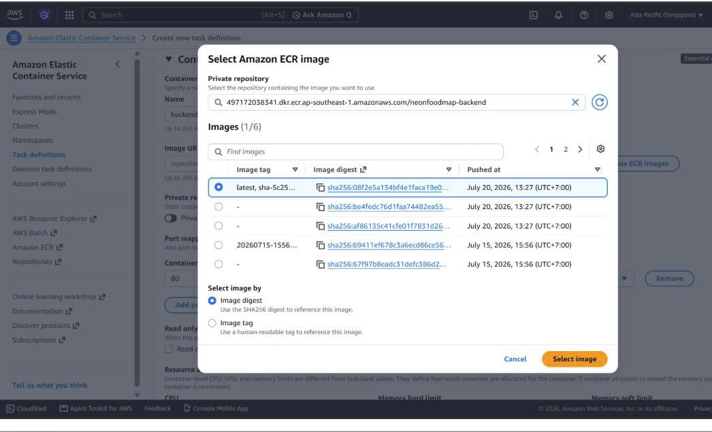 
5. Khai báo các biến cần thiết cho task definition. Với thông tin password quan trọng chọn ValueFrom để đọc từ AWS Secrets Manager. 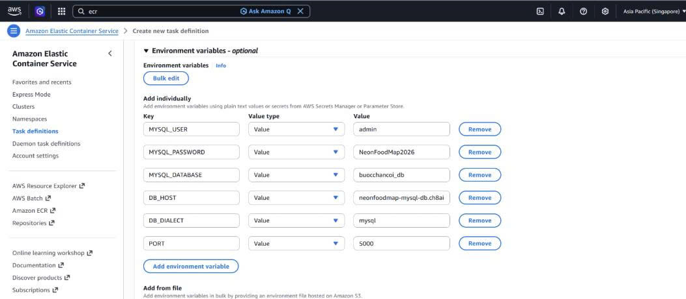
6. Trong phần logging, chọn CloudWatch Logs, tạo/chọn log group `/ecs/neonfoodmap-backend` và region `ap-southeast-1`. Thiết lập log retention theo chính sách dự án. 
7. Nhấn **Create** để đăng ký revision.

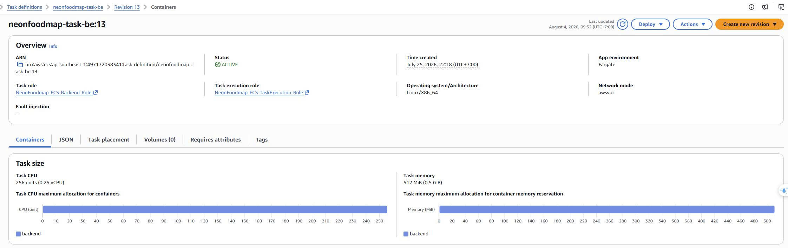

## Tạo Application Load Balancer

ALB được đặt trong hai public subnet, nhận lưu lượng Internet và chỉ chuyển tiếp request API vào backend ECS task trong private subnet. Lớp phân tách này giúp backend không nhận truy cập trực tiếp từ Internet.

### Tạo Security Group cho ALB

1. Mở **EC2 Console → Security Groups → Create security group**.
2. Đặt tên `alb-sg`, mô tả *Security Group cho Public Application Load Balancer* và chọn VPC của dự án.
3. Thêm hai inbound rule: **HTTP / 80 / Anywhere-IPv4 (`0.0.0.0/0`)** và **HTTPS / 443 / Anywhere-IPv4 (`0.0.0.0/0`)**. 
4. Giữ outbound rule mặc định để ALB có thể gửi request tới ECS task, sau đó chọn **Create security group**. 

Security group của ECS task cấu hình theo chiều ngược lại: chỉ cho phép port `8000` của backend có source là `alb-sg`; không mở port này cho `0.0.0.0/0`. 

### Tạo Target Group và Health Check

ECS Fargate cấp private IP cho task, vì vậy target group phải dùng **Target type: IP addresses**. Không cần đăng ký IP thủ công vì ECS service sẽ tự đăng ký/deregister task khi deploy.

1. Vào **EC2 Console → Target Groups → Create target group** và tạo target group backend với cấu hình sau. 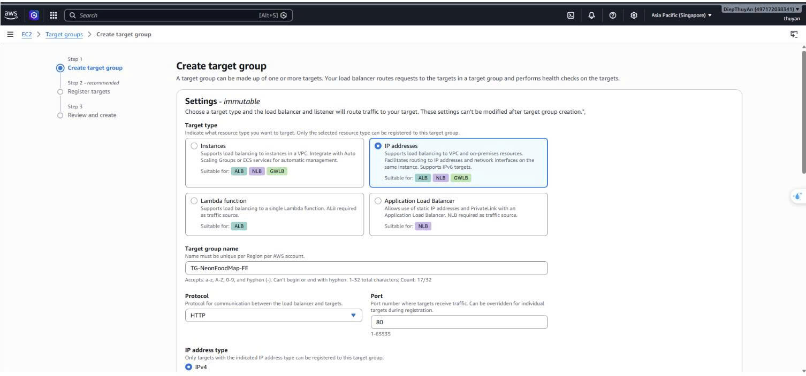

| Trường                      | Giá trị backend      |
| ----------------------------- | ---------------------- |
| Target group name             | `TG-NeonFoodMap-BE`  |
| Target type                   | **IP addresses** |
| Protocol / Port               | HTTP /`8000`         |
| Health check path             | `/api/health/`       |
| Healthy / Unhealthy threshold | `2` / `2`          |
| Health check interval         | `30 seconds`         |

2. Chọn **Next**, bỏ qua bước đăng ký target IP và chọn **Create target group**. 

### Tạo ALB và Listener

1. Vào **EC2 Console → Load Balancers → Create load balancer**, chọn **Application Load Balancer**.
2. Nhập tên `ALB-NeonFoodMap`, chọn *Scheme* **Internet-facing** và *IP address type* **IPv4**. 
3. Chọn VPC của dự án. Trong *Network mapping*, chọn đủ hai Availability Zone và hai **public subnet** có route đến Internet Gateway. 
4. Bỏ chọn default security group, sau đó chọ `alb-sg` đã tạo.
5. Tạo listener **HTTP : 80**. Ở *Default action*, chọn **Forward to** `TG-NeonFoodMap-BE`, rồi nhấn **Create load balancer**. 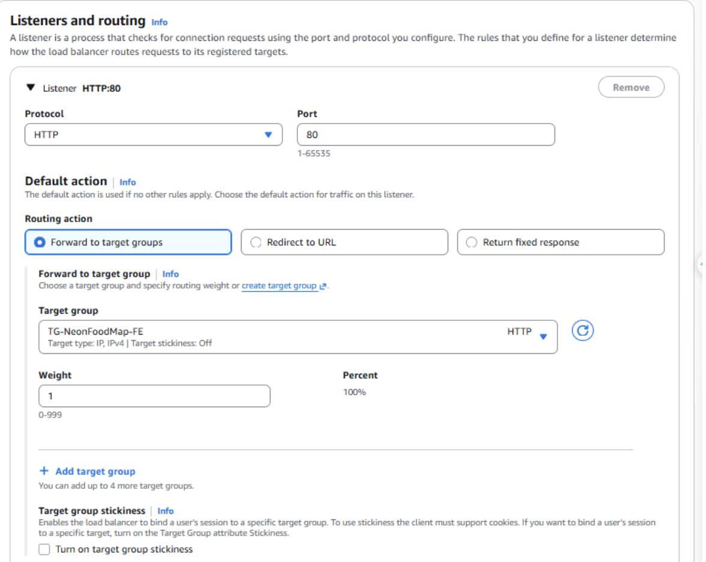

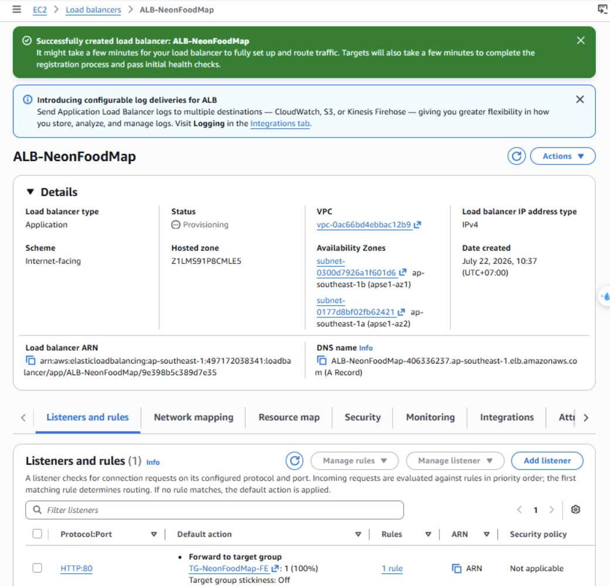

ALB được cấu hình với default action forward tới backend target group. Tất cả request API được chuyển đến backend service trong ECS. Frontend được phân phối qua CloudFront/S3, không qua ALB. Khi triển khai HTTPS, thêm listener `443` gắn ACM certificate và chuyển hướng listener `80` sang HTTPS.

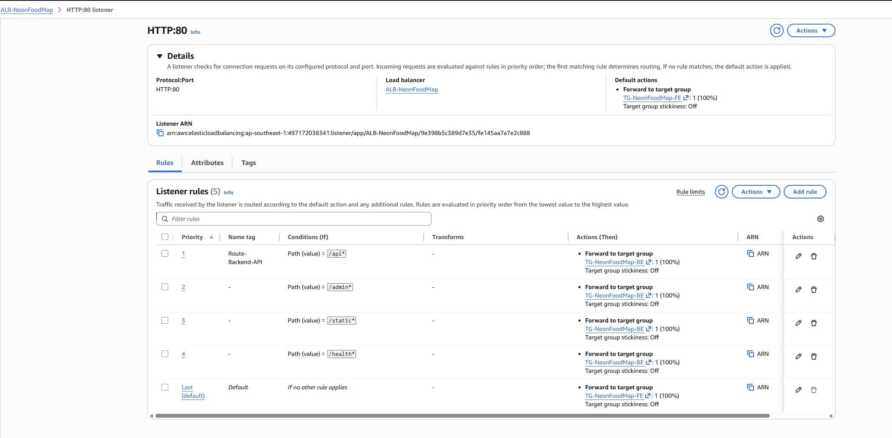

## Tạo ECS Service và liên kết Target Group

Sau khi có backend task definition, target group và ALB, tạo ECS service để ECS tự quản lý vòng đời task và đăng ký private IP vào target group.

### Tạo Backend Service

1. Mở **ECS → Clusters → NeonFoodmap-cluster → Create service**.
2. Chọn task definition family `neonfoodmap-task-be`, đặt service name `svc-neonfoodmap-be` và chọn **Task definition revision latest**. 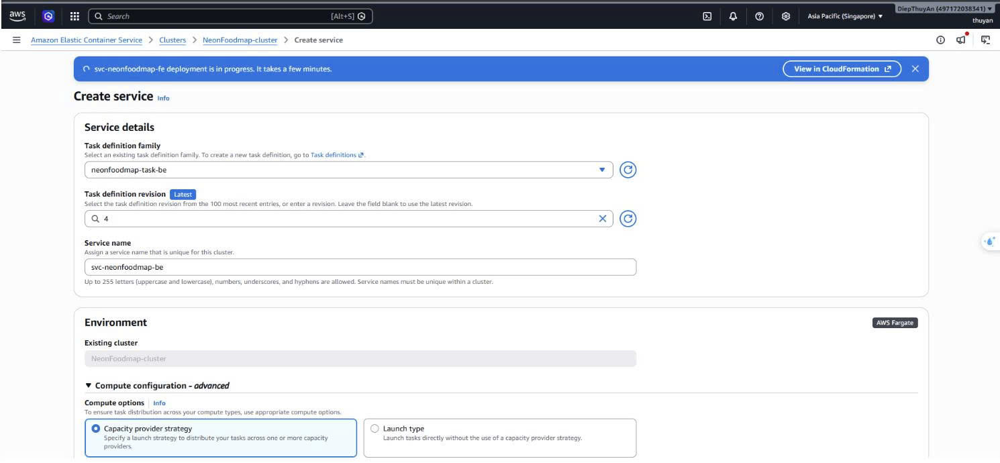
3. Trong phần networking, chọn VPC và các **private subnet** của ứng dụng, chọn ECS task security group. 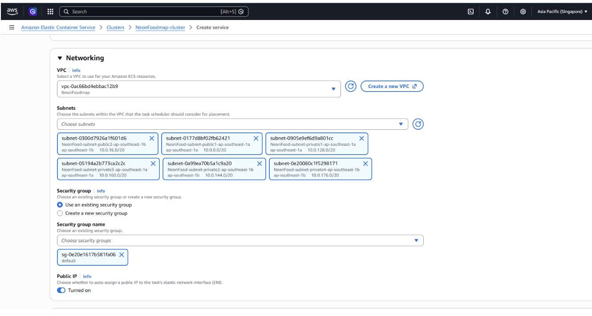
4. **Load balancing**, chọn **Application Load Balancer** `ALB-NeonFoodMap`; chọn existing listener `80:HTTP`, container backend port `8000` và existing target group `TG-NeonFoodMap-BE`. 
5. Kiểm tra cấu hình, chọn **Create**. ECS sẽ tự tạo task và đăng ký IP task vào backend target group. 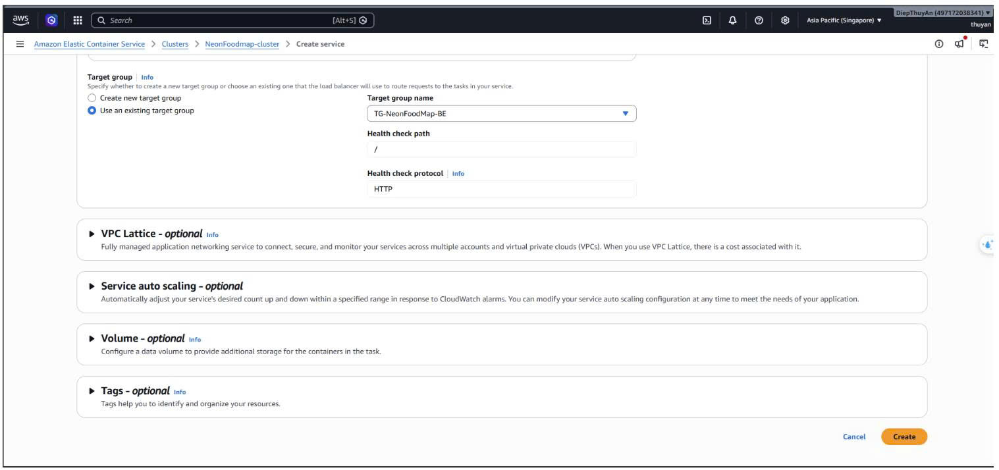

Sau khi tạo, ECS thực hiện rolling deployment. Trong thời gian này, giữ task đủ `Healthy` để ALB không chuyển request vào task chưa sẵn sàng.

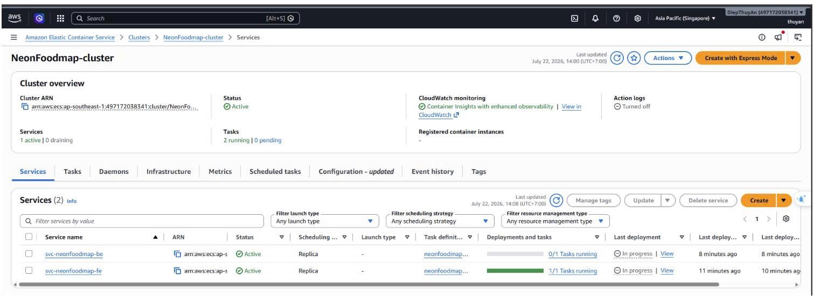
