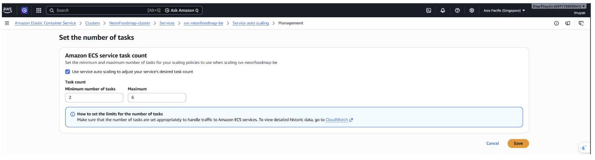
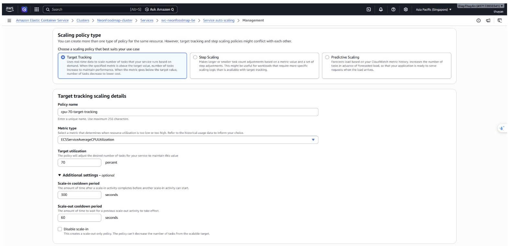
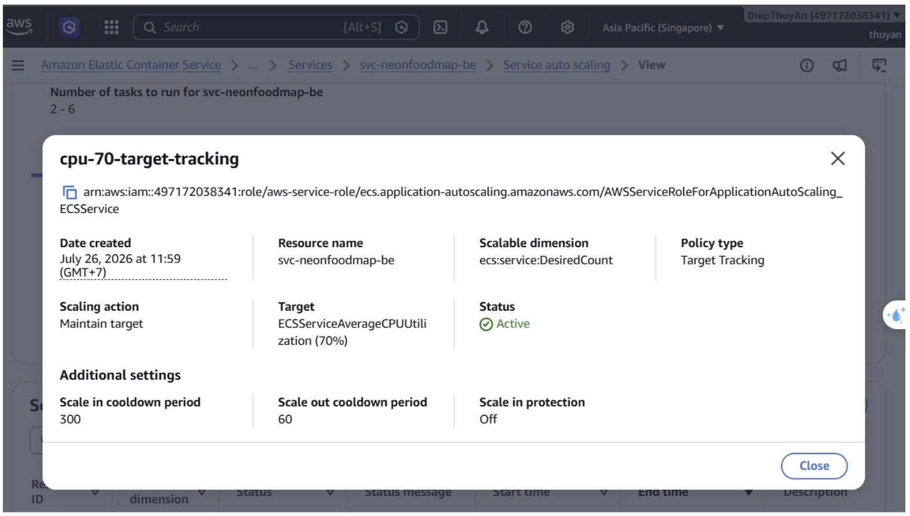
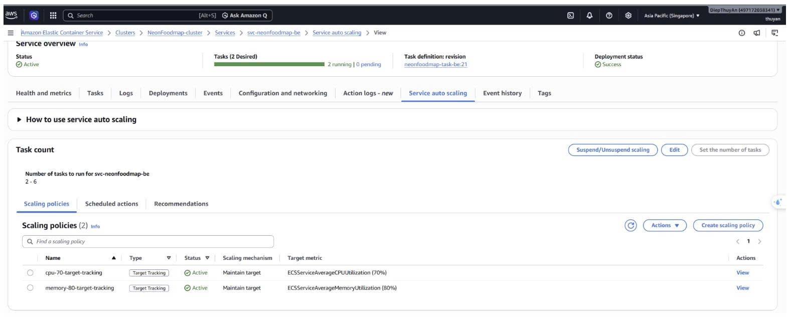
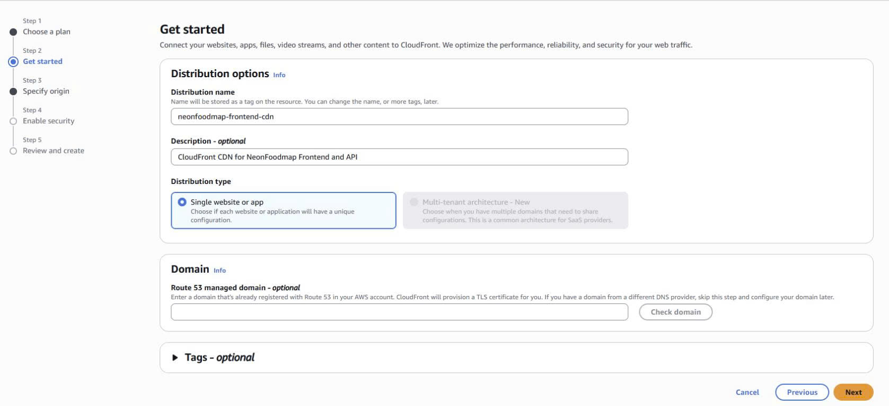
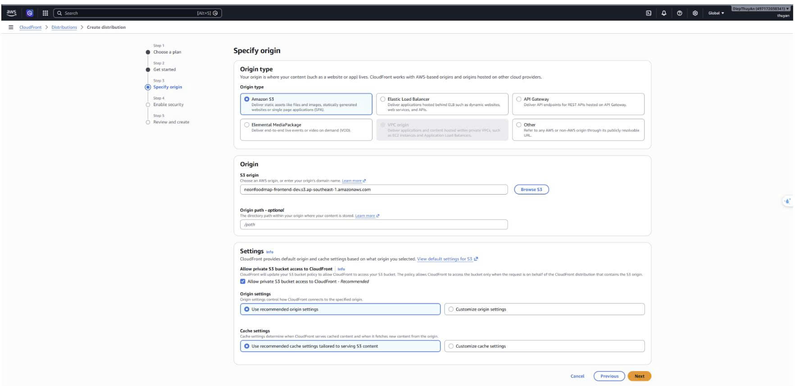
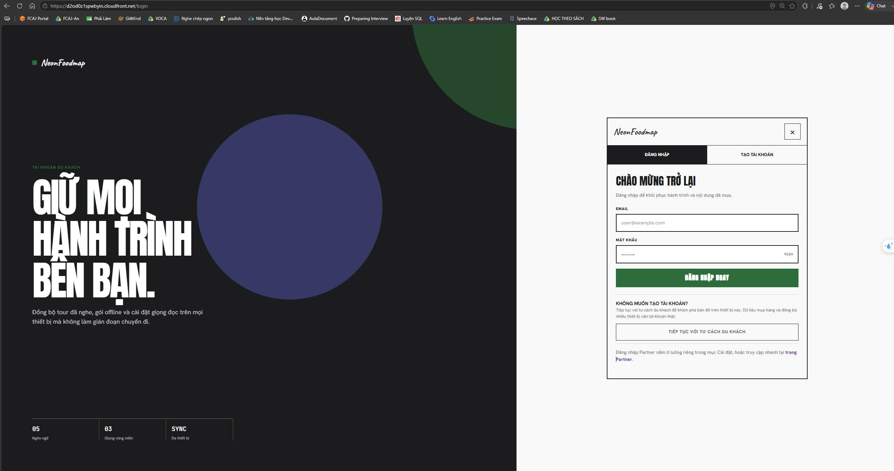

## Cấu hình ECS Service Auto Scaling

Auto Scaling được áp dụng cho backend service, kế thừa task definition, ALB và target group ở mục 5.4.4.

### Bật Auto Scaling và CPU Policy

1. Mở service `svc-neonfoodmap-be`, vào tab **Service auto scaling** và chọn **Update**.
2. Bật **Use service auto scaling**. Trong phần *Capacity limits*, đặt số task tối thiểu là `2` và tối đa là `6`. Nhờ đó backend luôn có hai task sẵn sàng nhận request, nhưng chỉ được mở rộng tối đa sáu task để kiểm soát chi phí. 
3. Trong phần scaling policy, chọn **Target tracking**. Đặt tên policy là `cpu-70-target-tracking` và chọn metric **ECSServiceAverageCPUUtilization**. Metric này là mức sử dụng CPU trung bình của tất cả task đang chạy trong service.
4. Đặt *Target value* là `70`. Khi CPU trung bình vượt 70%, ECS Service Auto Scaling sẽ tăng thêm task để chia tải. Khi CPU giảm, ECS có thể giảm task nhưng không thấp hơn giới hạn tối thiểu là hai task.
5. Đặt *Scale-out cooldown* là `60 seconds` và *Scale-in cooldown* là `300 seconds`, sau đó lưu policy. Sau mỗi lần scale-out, ECS chờ 60 giây để task mới khởi động và đăng ký vào target group. Scale-in chờ 5 phút để tránh tình trạng tải dao động làm task bị tăng/giảm liên tục. 

Sau khi lưu, policy `cpu-70-target-tracking` sẽ theo dõi CPU của service trong giới hạn từ `2` đến `6` task.





## Cấu hình CloudFront cho Frontend Static Assets

CloudFront phân phối React SPA frontend (static build) qua CDN, trong khi S3 vẫn giữ private. Frontend được build bằng Vite và upload lên S3, sau đó CloudFront phục vụ nội dung với độ trễ thấp. Môi trường hiện tại sử dụng domain mặc định do CloudFront cấp, chưa cấu hình Route 53 hoặc custom domain.

### Tạo CloudFront Distribution

Mở CloudFront Console → Distributions và chọn Create distribution, sau đó điền các thông số sau:

**Distribution name:** Nhập tên `neonfoodmap-frontend-cdn`.

**Description – optional:** Có thể để trống hoặc nhập `CloudFront CDN for NeonFoodmap React Frontend SPA`.

**Distribution type:** Giữ tùy chọn **Single website or app**.

**Domain (Route 53 managed domain – optional):** Để trống vì dự án dùng URL mặc định `*.cloudfront.net` do AWS cấp.



### Cấu hình S3 Origin và OAC

**Origin type:** Chọn **Amazon S3**.

**S3 origin:** Chọn bucket `neonfoodmap-frontend-dev.s3.ap-southeast-1.amazonaws.com`.

**Origin path – optional:** Để trống, không nhập `/path` vì frontend được lưu tại thư mục gốc của bucket.

**Allow private S3 bucket access to CloudFront:** Giữ chọn **Allow private S3 bucket access to CloudFront – Recommended**. Đây là tính năng **Origin Access Control (OAC)**, cho phép CloudFront đọc bucket private và ngăn người dùng truy cập trực tiếp vào S3.

**Origin settings:** Giữ tùy chọn **Use recommended origin settings**.

**Cache settings:** Giữ tùy chọn **Use recommended cache settings tailored to serving S3 content**.



### Upload Frontend Build lên S3

Sau khi build frontend locally hoặc qua CI/CD:

1. Build React app bằng Vite:
```bash
cd frontend
npm run build
```

2. Upload thư mục `dist/` lên S3 bucket:
```bash
aws s3 sync dist/ s3://neonfoodmap-frontend-dev/ --delete
```

3. Invalidate CloudFront cache để distribution phục vụ phiên bản mới:
```bash
aws cloudfront create-invalidation \
  --distribution-id E1234567890ABC \
  --paths "/*"
```

### Truy cập ứng dụng

Đợi distribution có trạng thái **Enabled** và cập nhật hoàn tất. Truy cập URL CloudFront (ví dụ: `https://d111111abcdef8.cloudfront.net`) để xem frontend. Frontend sẽ gọi backend API qua ALB endpoint được cấu hình trong biến môi trường Vite.



**Lưu ý về API endpoint:** Frontend cần được build với `VITE_API_URL` trỏ đến ALB DNS name hoặc custom domain của backend API. Ví dụ:
```bash
VITE_API_URL=http://alb-neonfoodmap-123456789.ap-southeast-1.elb.amazonaws.com npm run build
```


