## 1. Thu thập log và dùng Logs Insights

### Cấu hình log group cho ECS

1. Trong task definition backend, chọn **awslogs** log driver, Region `ap-southeast-1` và log group `/ecs/neonfoodmap-backend`.

2. Vào **CloudWatch → Log groups**, mở log group, chọn **Actions → Edit retention setting** và đặt thời gian lưu trữ `30 days`.

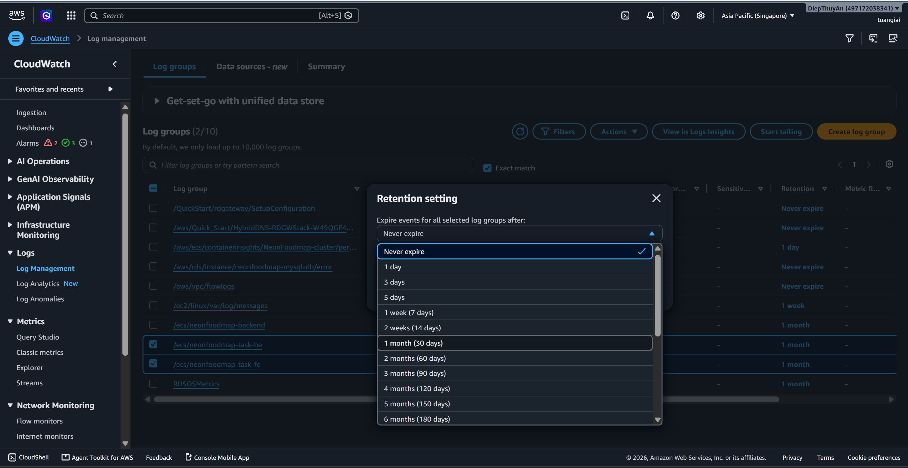

3. Sau khi ECS service khởi tạo task, kiểm tra log stream để xác nhận container đang ghi log.

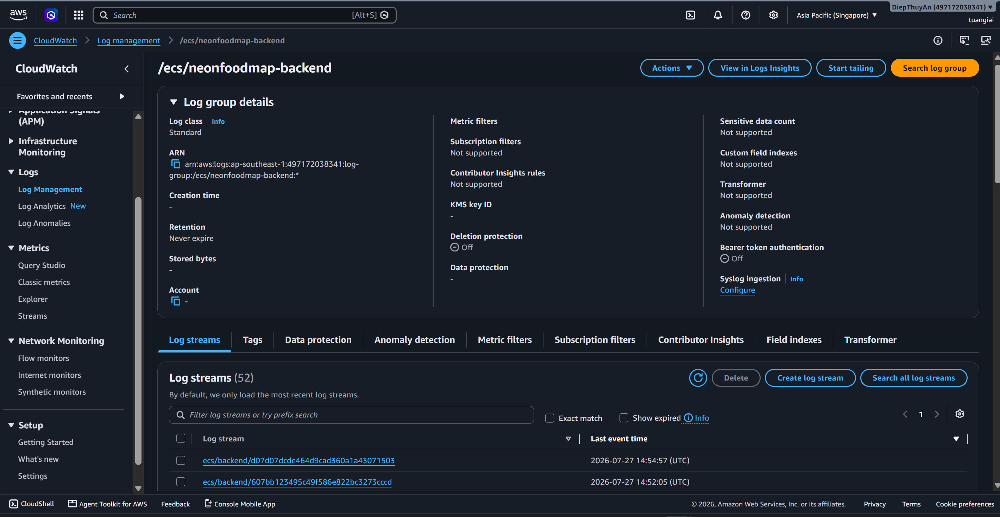

### Lưu truy vấn Logs Insights

1. Chọn **CloudWatch → Logs Insights** và chọn log group backend.
2. Tạo, chạy và lưu các truy vấn phục vụ vận hành: tìm lỗi/exception, kiểm tra health check và lọc request 5XX. Điều chỉnh field hoặc pattern theo định dạng log của ứng dụng.

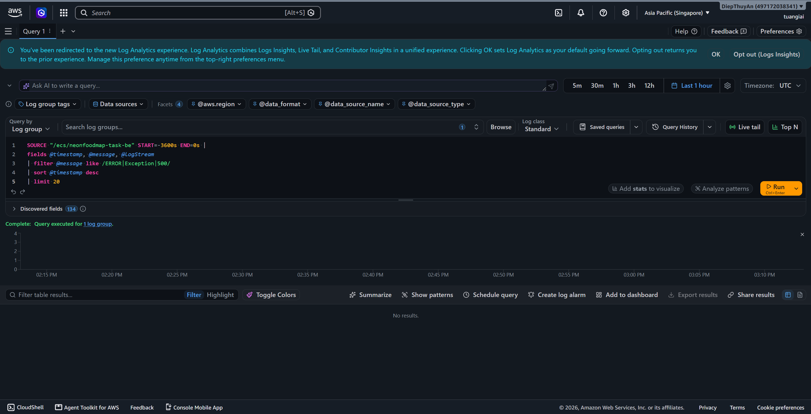

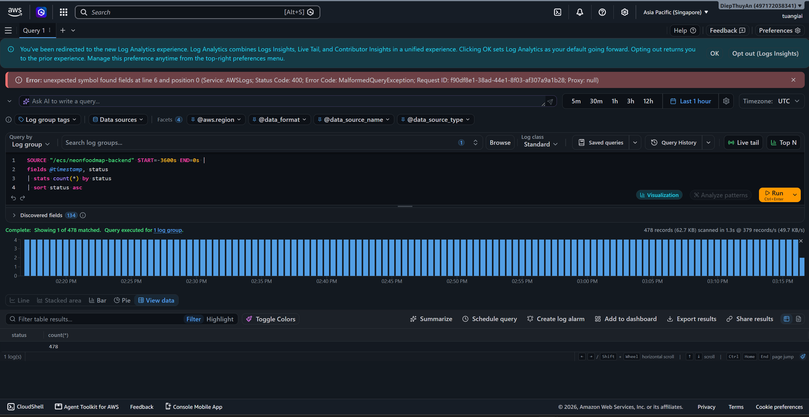

## 2. Tạo dashboard vận hành

1. Vào **CloudWatch → Dashboards → Create dashboard**, đặt tên `NeonFoodMap-Operational-Dashboard`.

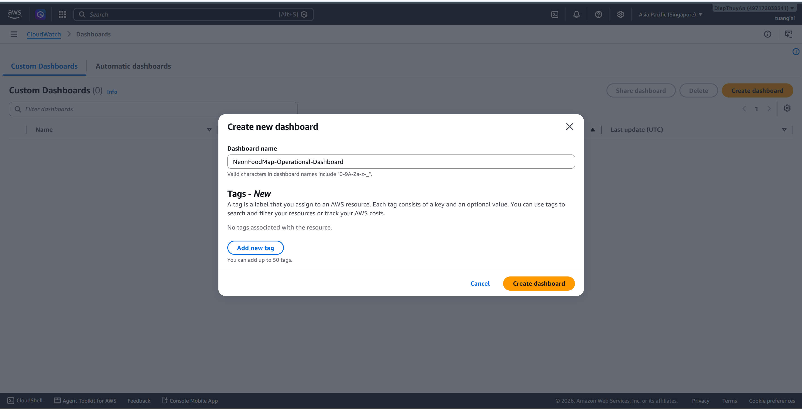

2. Chọn **Add widget** và dùng loại biểu đồ phù hợp như **Line** hoặc **Number**.

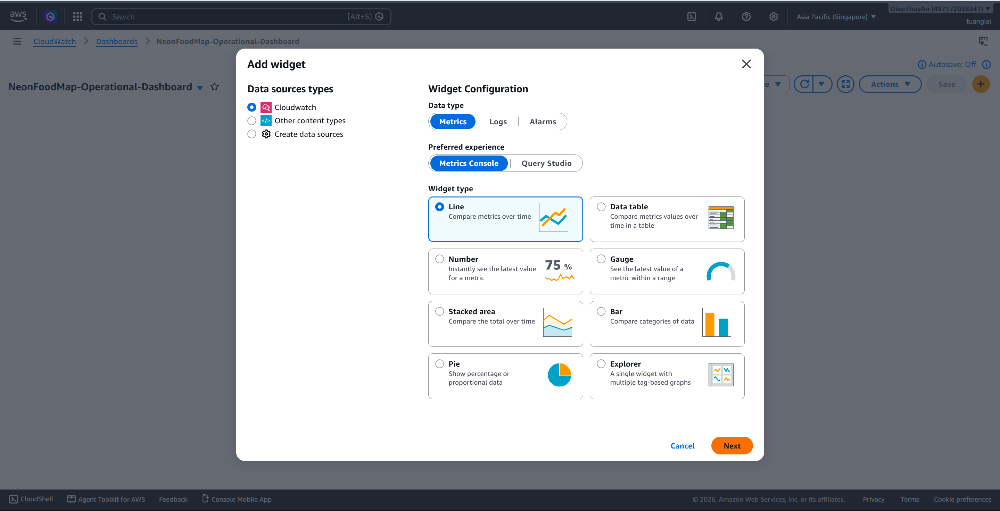

3. Thêm các chỉ số quan trọng: ECS backend CPU/memory và số task; ALB request count, target response time, healthy host và 5XX; RDS CPU, số kết nối và dung lượng trống; CloudFront requests và cache hit rate (cho frontend).

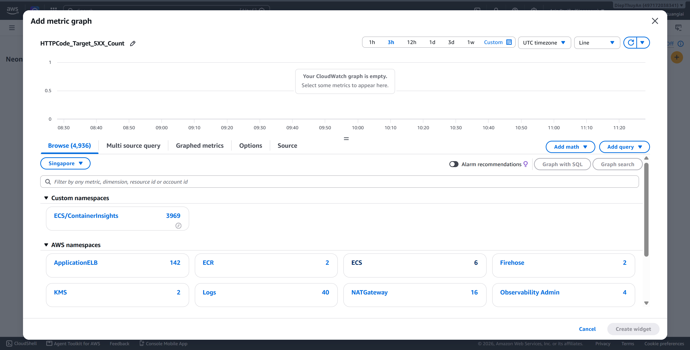

**Lưu ý:** Dashboard không cần theo dõi frontend container vì frontend được phân phối qua CloudFront/S3 dưới dạng static assets. Để theo dõi frontend delivery, thêm CloudFront metrics như request count, error rate và cache statistics.

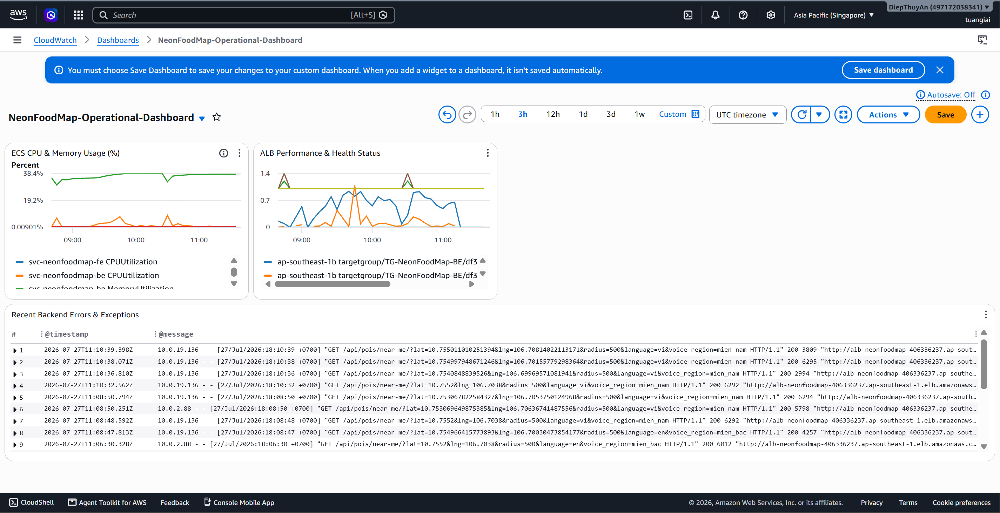

## 3. Tạo cảnh báo và thông báo SNS

1. Tạo SNS topic `NeonFoodMap-Alerts` trong **Amazon SNS → Topics**, sau đó tạo subscription kiểu **Email** và xác nhận email nhận được.

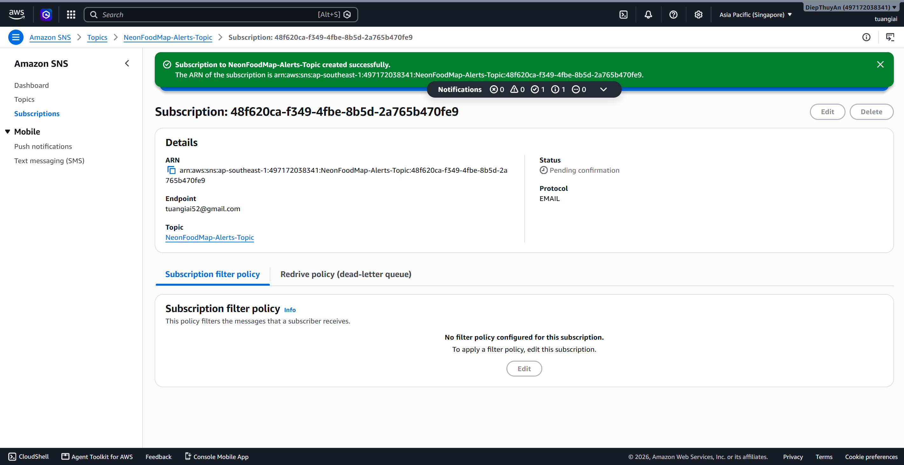

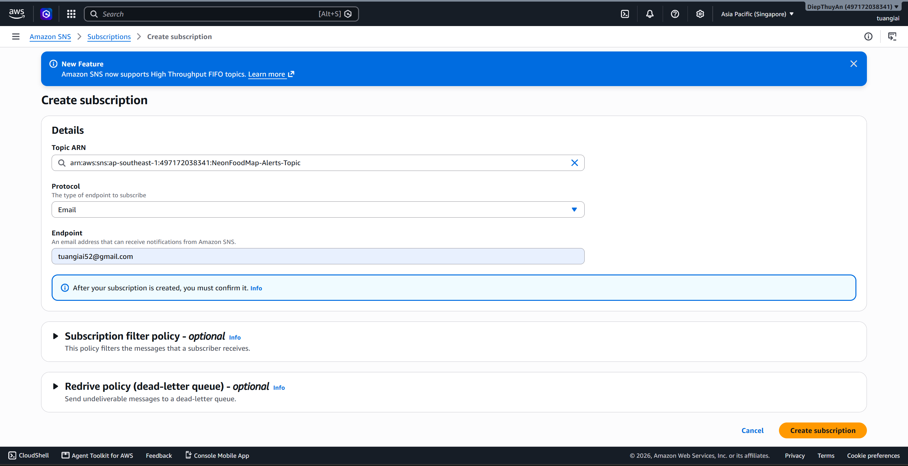

2. Vào **CloudWatch → Alarms → Create alarm**, chọn metric, đặt ngưỡng và chọn `NeonFoodMap-Alerts-Topic` làm notification action.

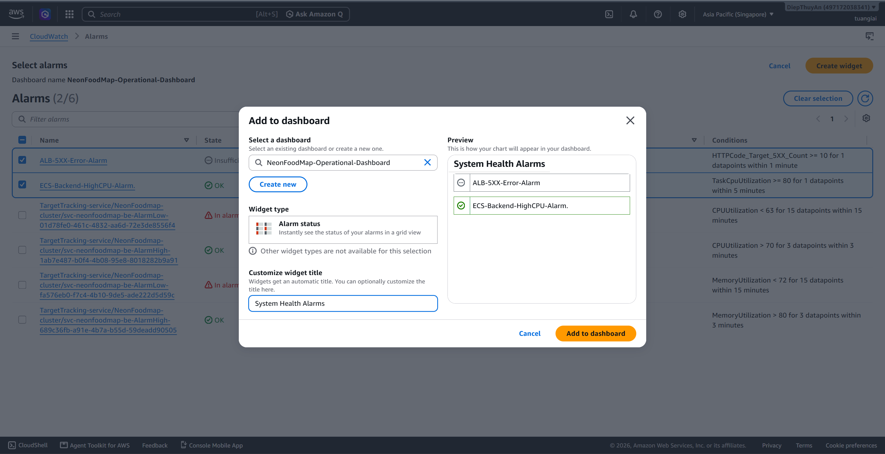

3. Tạo hai alarm sau: 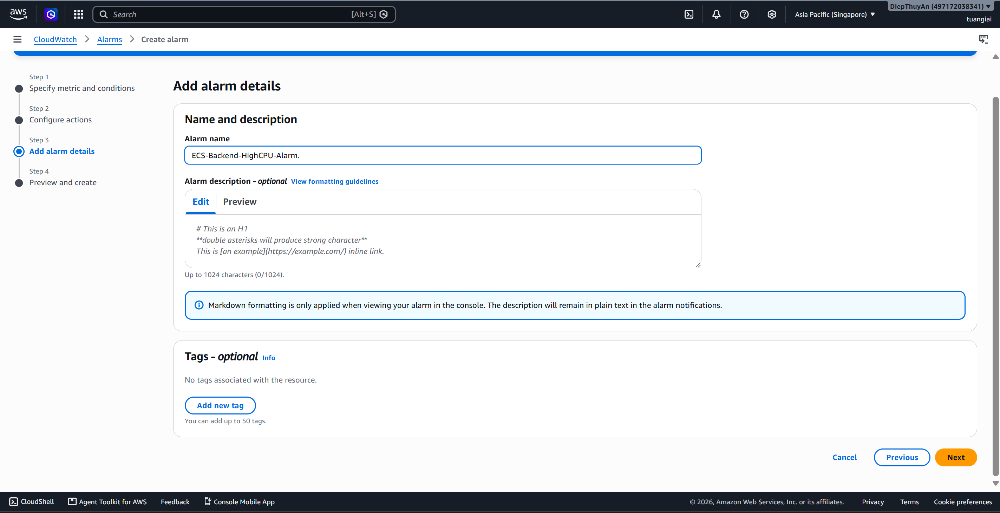 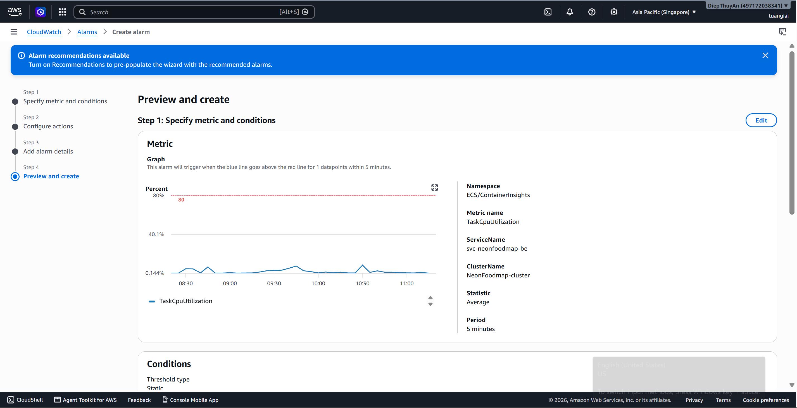

| Alarm                         | Metric                              | Ngưỡng                       |
| ----------------------------- | ----------------------------------- | ------------------------------ |
| `ECS-Backend-HighCPU-Alarm` | `ECSServiceAverageCPUUtilization` | `>= 80%` trong `5 minutes` |
| `ALB-5XX-Error-Alarm`       | `HTTPCode_Target_5XX_Count`       | `>= 10` trong `1 minute`   |

4. Kiểm tra alarm hiển thị trạng thái **OK** hoặc **Insufficient data**.

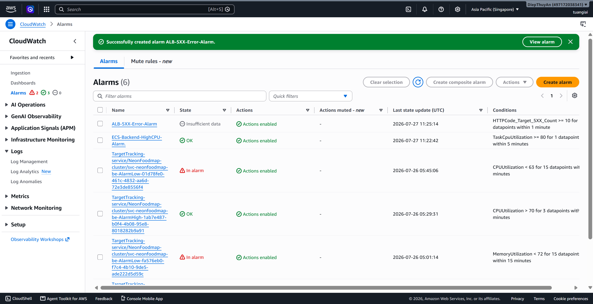

## 4. Bật VPC Flow Logs

1. Vào **Amazon VPC → Your VPCs**, chọn VPC của hệ thống và mở tab **Flow Logs**.

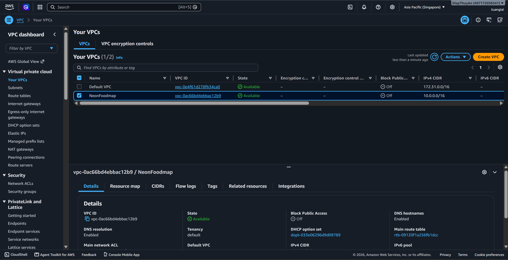

2. Chọn **Create flow log**.

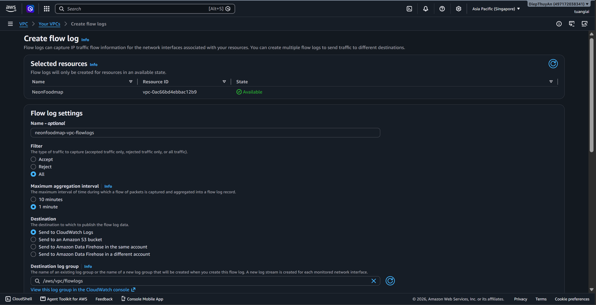

3. Đặt **Traffic type** là `All`, **Destination** là `CloudWatch Logs`, chọn log group riêng và IAM role phù hợp.

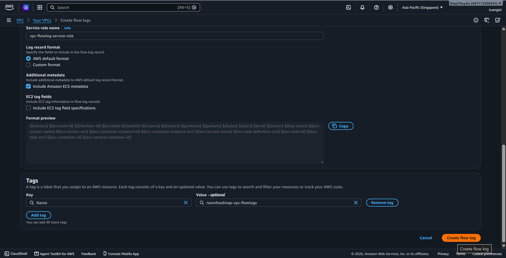

4. Tạo Flow Log và kiểm tra trạng thái `Active`. Chỉ bật khi cần vì Flow Logs phát sinh chi phí lưu trữ và truy vấn.

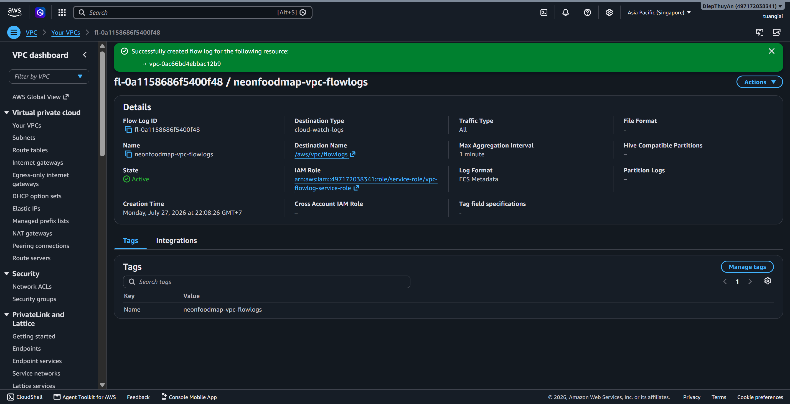
